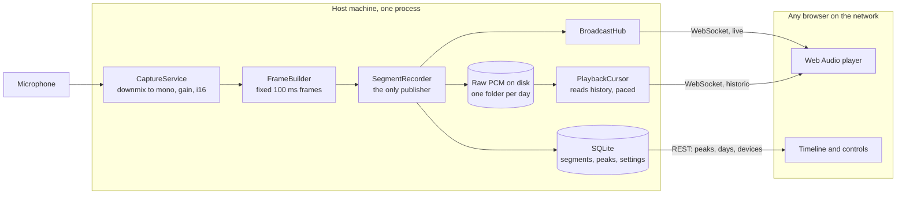

# On Air Record

A cross platform audio broadcast and DVR service written in Rust, with a browser based control room UI
built in React. The service captures audio from a microphone on the host machine, streams it live to any
browser on the local network, records it continuously to disk, and lets you scrub back to any point in the
past on a CCTV style timeline.

Think of it as a small FM station plus a digital video recorder for sound:

- The host machine is the studio (it owns the microphone).
- The browser is the radio receiver (it plays the live signal).
- The timeline is the tape (you can rewind, play back history, and jump back to live).


## Quick start

### The installer, on macOS and Linux

Run this from wherever you want it to live:

```bash
curl -fsSL https://raw.githubusercontent.com/shibbirweb/on-air-record/master/scripts/install.sh | sh
```

It works out which build the machine needs, downloads the latest release, checks it against the published
checksum, asks once which port to use, and starts the service. Everything goes into an `on-air-record`
folder created right there:

```
on-air-record/
  on-air-record     the program
  start.sh          starts it again with your settings
  config            your settings
  data/             recordings and the database
```

Nothing is written anywhere else, so moving the installation is moving that folder, and removing it is
deleting it. Start it again any time with `./on-air-record/start.sh`, which reads the config, so the port
only has to be chosen once. Re-run the installer with `--update` for a newer release, `--release v0.1.0`
for a specific one, or `--reconfigure` to change the port. `--help` lists the rest.

There is no prebuilt binary for ARM Linux, such as a Raspberry Pi. The installer says so and points at
[building from source](#build-from-source).

### The installer, on Windows

Run this in PowerShell, from wherever you want it to live:

```powershell
irm https://raw.githubusercontent.com/shibbirweb/on-air-record/master/scripts/install.ps1 | iex
```

Same idea and the same folder, with `start.cmd` beside the program so it can be started by double clicking
it in Explorer. Windows asks whether to allow it through the firewall the first time; say yes for private
networks, or no other machine can listen.

`iex` cannot pass options, so use the script block form for those:

```powershell
& ([scriptblock]::Create((irm https://raw.githubusercontent.com/shibbirweb/on-air-record/master/scripts/install.ps1))) -Port 9000
```

### By hand

A release build carries the web UI inside the executable, so there is one file to copy and nothing to
point it at. Download the archive for your platform from the
[releases page](https://github.com/shibbirweb/on-air-record/releases), extract it, and run it:

```bash
tar -xzf on-air-record-<version>-<target>.tar.gz
cd on-air-record-<version>-<target>
./on-air-record
```

On Windows, extract the `.zip` and run `on-air-record.exe`. macOS will refuse an unsigned download on the
first attempt; allow it under System Settings, Privacy and Security. The installers above avoid both that
prompt and SmartScreen, because a file fetched with `curl` or `irm` is not quarantined the way a browser
download is.

Then open `http://localhost:8080` on the host, or `http://<host-lan-ip>:8080` from any other machine on
the same network. Recordings and the database are written to `./data` next to wherever you ran it, which
`--data-dir` moves somewhere sensible.

### Build from source

You need Rust and Node, and the UI must be built first, because a release build embeds whatever is in
`frontend/dist` at compile time:

```bash
make build      # the UI, then the binary, in the order that matters
make run
```

Or without `make`:

```bash
# 1. build the web UI
cd frontend
npm install
npm run build

# 2. build and run the service
cd ../backend
cargo run --release
```

For development with hot reload, run the backend and the Vite dev server side by side:

```bash
cd backend && cargo run          # terminal 1, API on :8080
cd frontend && npm run dev       # terminal 2, UI on :5173, proxied to :8080
```

A directory given with `--static-dir` always wins over the embedded copy, so a debug build serves whatever
you last built into `frontend/dist` without a recompile.

All of this is covered at more length in the **[installation guide](docs/SETUP.md)**, including running it
as a service and reaching it from other machines. The **[user guide](docs/USER_GUIDE.md)** then walks
through every part of the interface with screenshots.

## Table of contents

- [Quick start](#quick-start)
- [Highlights](#highlights)
- [How it works](#how-it-works)
- [Requirements](#requirements)
- [Running it as a service](#running-it-as-a-service)
- [Configuration](#configuration)
- [Project layout](#project-layout)
- [Feature status](#feature-status)
- [Testing](#testing)
- [Documentation](#documentation)
- [Troubleshooting](#troubleshooting)
- [Reporting a problem](#reporting-a-problem)
- [Author](#author)
- [License](#license)

## Highlights

- **Single binary service.** The Rust backend serves the REST API, the WebSocket audio stream, and the
  compiled web UI from one process, with the UI baked into the executable so a release is one file. Built
  for macOS, Linux (desktop and headless server), and Windows, see [Requirements](#requirements) for which
  of those have actually been exercised.
- **Live broadcast.** Captured audio is fanned out to every connected browser through a WebSocket, so
  several listeners on the LAN hear the same signal at the same time.
- **Always on recording.** Audio is written to disk in fixed length segments and indexed in SQLite, so the
  recorder keeps running even when nobody is listening.
- **DVR timeline.** Seek to any timestamp inside the retention window, play history at real time pace, and
  return to the live edge with one click.
- **Day by day history.** Recordings are filed on disk by calendar day and indexed the same way, so you can
  pick a day and play from any point in it, the way you would scrub a CCTV recording.
- **Waveform with timeline.** Amplitude peaks are computed while recording and stored alongside each
  segment, so the UI can draw the waveform for both live audio and history.
- **Device picker.** All host input devices are enumerated at runtime, and the selected device is persisted
  in SQLite so the service comes back on the same microphone after a restart.
- **Bounded disk use.** A retention window is enforced by a janitor that prunes expired audio, its index
  rows, and the directories they leave behind, so an always on recorder cannot quietly fill the disk.
- **Optional logins.** The first visit asks whether to set up accounts or keep it open. With accounts,
  admins control the recorder and listeners can only listen, scrub and export. Either way, pages served by
  other websites cannot listen in or press buttons. Still built for a local network, not the open internet.

## How it works



1. `CaptureService` opens the selected input device with `cpal`, downmixes to mono, and converts every
   callback into 16 bit PCM frames stamped with a wall clock timestamp.
2. Frames go to a `BroadcastHub` (a tokio broadcast channel) that every live listener subscribes to, and to
   the `SegmentRecorder`, which appends them to the current segment file.
3. When a segment reaches its configured length the recorder closes it, computes its peak envelope, and
   writes one row to SQLite describing the time range, the file, and the envelope blob.
4. A browser asks for history over the same WebSocket. The `PlaybackService` reads the matching segments
   from disk and paces them out at real time, then hands the client over to the live hub once it catches up.

## Requirements

Only to build from source. A release archive needs none of this.

- Rust 1.82 or newer (stable toolchain).
- Node.js 22 (see [frontend/.nvmrc](frontend/.nvmrc)) and npm, only needed to build the web UI.
- Linux additionally needs ALSA development headers: `sudo apt install libasound2-dev pkg-config`.
- macOS and Windows need no extra audio packages (CoreAudio and WASAPI are used through `cpal`).

Portability comes from the dependencies rather than from conditional code: `cpal` covers CoreAudio, ALSA
and WASAPI behind one API, `rusqlite` bundles SQLite, and there is no platform specific code beyond the
SIGTERM handler.

Where each platform stands:

| Platform | State |
| --- | --- |
| macOS (Apple silicon and Intel) | Built and run end to end, including capture, DVR playback and WAV export |
| Linux (x86_64) | Built and run end to end in a container: full test suite, and an exported WAV validated with `ffprobe` |
| Windows (x86_64) | Built and tested by CI only. Nobody has yet run the service on a Windows desktop and listened to it |

The Windows gap is deliberate rather than an oversight. Cross compiling from macOS is not a substitute,
because the bundled SQLite needs a C toolchain for the target, so the [CI workflow](.github/workflows/ci.yml)
runs the whole suite on a Windows runner instead. That covers the code but not the audio hardware, which
is why the row above says what it says.

## Running it as a service

[docs/SETUP.md](docs/SETUP.md) has the full instructions for all three platforms, including firewall rules
and the pitfalls. The short version:

- **Linux**: [packaging/on-air-record.service](packaging/on-air-record.service) is a systemd unit template
  whose header comment carries the install sequence. Do not skip `sudo usermod -aG audio on-air-record`, or
  the service starts, serves the UI, and lists no input devices at all, which looks like a hardware fault
  rather than a permissions one.
- **Windows**: no service wrapper is built in, because a code path nobody here can test is worse than a
  documented command. Use [NSSM](https://nssm.cc/), which supervises a console program properly, or
  `sc.exe`. Either way the service must run as a real user account, because the Windows audio session
  belongs to the signed in user and `LocalSystem` may see no capture devices.
- **macOS**: use a per user LaunchAgent rather than a system LaunchDaemon. Microphone permission is granted
  to a logged in user, and a daemon has no user to have been granted it. Run the binary by hand once first
  so the permission prompt can appear.

## Configuration

Every option can be set with a CLI flag or an environment variable. CLI flags win, so a service's
configured port can be overridden for a single run without editing the service.

```sh
on-air-record --port 9000 --data-dir /srv/on-air-record
OAR_PORT=9000 OAR_DATA_DIR=/srv/on-air-record on-air-record
```

| Flag | Environment variable | Default | Description |
| --- | --- | --- | --- |
| `--host` | `OAR_HOST` | `0.0.0.0` | Address the HTTP server binds to |
| `--port` | `OAR_PORT` | `8080` | HTTP port |
| `--data-dir` | `OAR_DATA_DIR` | `./data` | Root directory for recordings and the database |
| `--static-dir` | `OAR_STATIC_DIR` | `../frontend/dist` | Compiled web UI to serve |
| `--log-level` | `OAR_LOG_LEVEL` | `info` | `error`, `warn`, `info`, `debug`, or `trace` |

`--data-dir` defaults to a path **relative to the working directory**, so a service started from elsewhere
will appear to have lost its recordings when it has in fact made a second `data` directory. Give it an
absolute path.

Runtime preferences (input device, segment length, retention window, gain, auto start and its delay) live
in the SQLite `settings` table and are editable from the UI.

[docs/SETUP.md](docs/SETUP.md#choosing-a-port) explains each of these for a non technical audience,
including what to do when the port is already in use.

## Project layout

```
on-air-record/
  backend/            Rust service (API, capture, recorder, playback)
    src/
      audio/          Capture, encoding, peaks, segment writer
      config/         CLI and environment configuration
      controllers/    HTTP and WebSocket request handlers
      db/             Connection pool and schema migrations
      dto/            Request and response payloads
      models/         Domain entities
      repositories/   SQLite data access
      routes/         Router composition
      services/       Application services and orchestration
      ws/             Streaming protocol and session actors
  frontend/           React 19 + Vite + Tailwind + shadcn/ui + Zustand
    src/
      api/            REST client and WebSocket transport
      components/     Reusable UI, including shadcn primitives
      features/       Feature modules (broadcast, timeline, devices, settings)
      hooks/          Shared React hooks
      lib/            Audio scheduling, formatting, utilities
      store/          Zustand stores
  docs/               Developer documentation
```

## Feature status

Legend: `[x]` done, `[~]` in progress, `[ ]` planned. Everything marked done has been exercised against a
running service on macOS, see [Testing](#testing) for what that covers and what it does not.

### Milestone 1: foundations

- [x] Single binary serving the REST API, the WebSocket, and the compiled web UI
- [x] Configuration from CLI flags and `OAR_*` environment variables, flags winning
- [x] SQLite storage in WAL mode with versioned, append only schema migrations
- [x] Repository layer for settings, sessions, and segments
- [x] Structured logging, with a `RUST_LOG` override for targeted debugging
- [x] Graceful shutdown on Ctrl+C and SIGTERM that flushes and indexes the open segment
- [x] Startup repair of sessions left open by a previous crash

### Milestone 2: audio capture

- [x] Cross platform input device enumeration (CoreAudio, ALSA, WASAPI)
- [x] Capture through `cpal` with automatic sample format and sample rate negotiation
- [x] Downmix to mono and conversion to 16 bit PCM, clipping rather than wrapping on overload
- [x] Selectable recording bit rate from 768 down to 128 kbps, with anti aliased downsampling
- [x] Software gain applied to the live signal without reopening the device
- [x] Hot swap of the input device without restarting the service
- [x] Fixed duration framing with sample derived timestamps and wall clock drift correction
- [x] Capture level metering (RMS and peak)
- [x] Dropped frame accounting when the recorder cannot keep up
- [x] Optional automatic capture on service start, with a configurable delay for slow USB devices

### Milestone 3: recording and storage

- [x] Continuous segmented recorder writing raw PCM to disk
- [x] Day based storage layout, `recordings/<YYYY-MM-DD>/<session>/`
- [x] Segment index in SQLite with precise time ranges and an indexed calendar day
- [x] A fresh segment on any timeline discontinuity, so stored byte offsets never lie
- [x] Waveform peak envelope computed during recording, one byte per 100 ms bucket
- [x] Retention janitor pruning expired segments, index rows, emptied directories and the bookmarks that
      pointed at them, or disabled entirely when recordings are kept forever
- [x] Recordings can live outside the data directory, with old segments still resolving
- [x] Storage, session, and history depth reporting
- [ ] Opus compression for segments, which would beat sample rate reduction for the same quality but
      needs a per segment frame index before seeking still works
- [x] Export a time range as a downloadable WAV file, streamed rather than buffered, with gaps written
      as silence so the file lines up with the timeline
- [x] Pick the export range from the visible window, a recent span, or typed start and end times

### Milestone 4: streaming

- [x] Binary WebSocket framing protocol for PCM audio, format carried per frame
- [x] Live fan out to any number of simultaneous listeners from one capture
- [x] Slow listeners resynchronised rather than disconnected, never stalling the recorder
- [x] DVR playback of stored segments paced at real time
- [x] Seek to an arbitrary timestamp inside the retention window
- [x] Recording gaps reported to the client rather than silently skipped
- [x] Automatic hand off from history back to the live edge on catching up
- [x] Playback transport controls (pause, resume, jump to live)
- [x] Keep alive ping and pong so idle connections survive proxies
- [x] Variable speed playback from a quarter to four times real time, forced back to real time on live
- [ ] Plain HTTP progressive stream for non JavaScript clients

### Milestone 5: web UI

- [x] Vite, React 19, TypeScript, Tailwind v4, and shadcn/ui setup
- [x] Zustand stores sliced by concern: status, connection, transport, devices, settings, timeline, storage
- [x] Web Audio scheduler with a jitter buffer and gapless frame to frame scheduling
- [x] Automatic reconnection with exponential backoff when the service restarts
- [x] Live waveform visualiser driven by the audio actually being played
- [x] Input level meter on a decibel scale, with a clipping warning
- [x] Scrubbable CCTV style timeline with recorded coverage shading and a live edge marker
- [x] Click to seek, drag to pan, scroll to zoom, with a hover time readout
- [x] Zoom presets from one minute to a day, a follow live toggle, and a reset to the standard view
- [x] Twenty four hour minimap under the timeline showing where the visible window sits in the day
- [x] Drag the window on the minimap, or click it, to move the detailed view
- [x] Zoom anchored on the marker, and on the pointer when scrolling
- [x] Cue marker showing the selected moment before playback has started
- [x] Calendar day picker, with days holding no recording shown as unselectable
- [x] Picking a day frames it on the timeline and plays from its first recorded moment
- [x] Transport controls: play, pause, jump back thirty seconds, go live, playback speed
- [x] Volume slider and mute
- [x] On air indicator and live listener count
- [x] Input device selector marking the system default and any unplugged device
- [x] Recorder panel: state, elapsed time, format, session, dropped frames, link health
- [x] Storage panel with disk usage, history depth, retention, and recent sessions
- [x] Dedicated settings page at `/settings`, with the audio pipeline living in the shell so navigating
      never interrupts playback
- [x] Retention expressed in hours or days, with presets, or kept forever
- [x] Projected disk needed for the chosen window, following the bit rate being chosen as you choose it
- [x] Configurable recording directory, with worked path examples in the server's own convention
- [x] Test button reporting readability, writability and whether the directory would be created, without
      touching the disk
- [x] Settings panel for gain, segment length, and automatic start
- [x] Explicit save: edits are staged, counted, and committed in one request, with Discard to abandon them
- [x] Restore defaults stages the defaults for review rather than applying them straight away
- [x] Saving asks first when it would shorten retention and delete audio
- [x] Light and dark themes with a toggle, remembered per browser
- [x] Responsive layout that reflows to a single column on narrow screens
- [x] Timeline bookmarks: name a moment, see it flagged on the timeline and the day overview, jump back
      to it from a list

### Milestone 6: packaging and operations

- [x] Compiled UI served with gzip and a single page app fallback
- [x] Build instructions page when the UI has not been compiled yet
- [x] Embed the compiled UI into the binary for a single file distribution
- [x] Continuous integration building and testing on macOS, Linux, and Windows
- [x] Release workflow producing macOS, Linux, and Windows artifacts
- [x] systemd unit template, with the Windows service wrapper documented

### Milestone 7: access control

- [x] First run choice between accounts and staying open, asked once
- [x] Email and password accounts, Argon2id hashed, with admin and listener roles
- [x] Server side sessions in an HttpOnly, SameSite=Strict cookie, revocable on the next request
- [x] Open streams re-checked every 15 seconds and closed when access ends
- [x] Other websites refused for state changes and the stream, in every mode
- [x] Failed login throttling per client address
- [x] Account management page, self service password change, and host side recovery commands
- [ ] Two factor sign in with an authenticator app

## Testing

```bash
cd backend  && cargo test                              # 257 unit and router tests
cd backend  && cargo clippy --all-targets -- -D warnings
cd frontend && npm test                                # Vitest, framework free logic
cd frontend && npm run lint
```

Backend tests concentrate on the arithmetic that fails quietly rather than loudly: frame timestamping and
drift correction, byte offsets inside a segment, the segment index queries, envelope rendering, and the
playback cursor walking a real directory of real PCM files across a recording gap. Frontend tests cover the
binary frame decoder, the timeline geometry, and the formatters.

What the automated tests do not cover, and what to check by hand after a change to the audio path:

- Press play and confirm sound comes out, since browsers only start audio from a user gesture.
- Click somewhere in a shaded band on the timeline and confirm playback jumps there.
- Pick an earlier day from the day selector and confirm it frames that day and starts playing it.
- Let it play forward to the live edge and confirm the badge flips back to `on air` on its own.

## Documentation

Both guides below are published to the [wiki](https://github.com/shibbirweb/on-air-record/wiki)
automatically on every push to `master`, so read them wherever suits you.

- [docs/SETUP.md](docs/SETUP.md): installing and running it on macOS, Linux and Windows, choosing a port,
  and keeping it running as a service.
- [docs/USER_GUIDE.md](docs/USER_GUIDE.md): how to use the app, in plain language and with screenshots.
  This is the one to hand to somebody who just wants to listen.
- [docs/ARCHITECTURE.md](docs/ARCHITECTURE.md): layers, design patterns, and data flow.
- [docs/AUDIO_PIPELINE.md](docs/AUDIO_PIPELINE.md): capture, framing, storage format, and DVR timing.
- [docs/API.md](docs/API.md): REST endpoints and the WebSocket protocol.
- [docs/DEVELOPMENT.md](docs/DEVELOPMENT.md): local setup, conventions, and troubleshooting.

## Troubleshooting

The most common first run problems:

- **The page says the web UI has not been built.** Only a source build can say this, and it means
  `frontend/dist` is empty. Run `npm install && npm run build` in `frontend/`. A release binary carries
  its own UI and cannot land here.
- **No devices are listed on macOS.** The first run triggers a microphone permission prompt. If it was
  denied, enable it under System Settings, Privacy and Security, Microphone, then restart the service.
- **On Linux it only records when started with `sudo`.** Your account is not in the `audio` group, which
  is usual for a login over SSH. Add it and log in again rather than carrying on with `sudo`, which leaves
  files behind that silently stop later runs from saving anything. The fix, and how to recover if you
  already used `sudo`, are in
  [Linux: microphone access](docs/SETUP.md#linux-microphone-access).

[docs/DEVELOPMENT.md](docs/DEVELOPMENT.md) has the rest.

## Reporting a problem

Bugs, questions and suggestions all go to the issue tracker:

**https://github.com/shibbirweb/on-air-record/issues**

A useful report says what you did, what you expected, what happened instead, your operating system, and
the version shown in the bottom right corner of the app. Run with `--log-level debug` and include the
output if the problem is in the audio path.

## Author

**MD. Shibbir Ahmed**, Senior Full Stack and AI Engineer.

- Portfolio: <https://shibbirweb.github.io>
- GitHub: <https://github.com/shibbirweb>
- Source: <https://github.com/shibbirweb/on-air-record>

## License

[MIT](LICENSE). Copyright (c) 2026 MD. Shibbir Ahmed.
