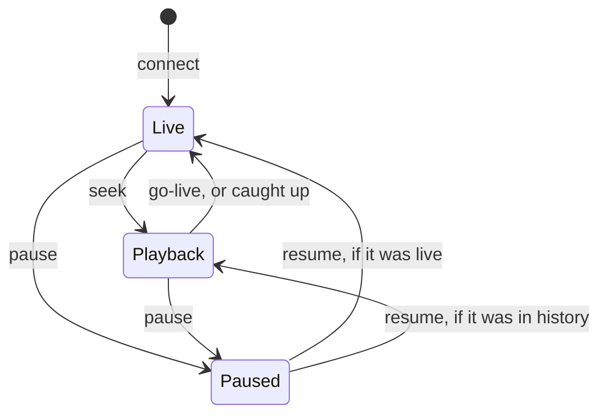

# API reference

Base URL: `http://<host>:8080`. All REST payloads are JSON with `camelCase` keys.

## Access

Each install is in one of three modes, chosen once by whoever opens the page first:

| Mode | Meaning |
| --- | --- |
| `undecided` | Nobody has answered the first run question yet. Behaves exactly like `open`. |
| `open` | No login. Every route works for anyone who can reach the service. |
| `accounts` | Every route except the public ones below needs a signed in session. |

With accounts on there are two roles. **Listeners** may call every `GET` (listen, scrub, export, read
state) and change their own password. **Admins** may call everything, including the account routes. A
listener calling an admin route gets `403 forbidden`; a request with no valid session gets
`401 unauthenticated`. The rule is "reading is listening, changing is administering", enforced by one guard
in front of the whole API (`backend/src/routes/guard.rs`), so it also covers any route added later.

Public in every mode: `GET /api/health`, `GET /api/auth/state`, `POST /api/auth/open`,
`POST /api/auth/setup`, `POST /api/auth/login`, `POST /api/auth/login/verify`, `POST /api/auth/logout`.

**Sessions** are an `oar_session` cookie: `HttpOnly`, `SameSite=Strict`, 30 days. It is marked `Secure`
when a reverse proxy sends `X-Forwarded-Proto: https`. The token is never in a response body, and only its
SHA-256 is stored. Every request checks it against the database, so signing out, removing an account or
changing a password takes effect on the next request. An open stream re-checks every 15 seconds and is
closed once its session is no longer valid.

**Other websites** are refused in every mode. A request that changes state (anything but `GET`, `HEAD`,
`OPTIONS`), and the WebSocket handshake, must carry either no `Origin` header, like `curl` or a script, or
an `Origin` whose host and port match the `Host` header. Otherwise the answer is `403 forbidden`. There is
no CORS policy, so another site's scripts cannot read any response either.

**Failed logins** are limited to 5 per client address in 15 minutes, after which that address gets
`429 rate_limited` until the window passes. The count is kept in memory, so restarting the service clears
it.

**Scripting with accounts on**: log in once, keep the cookie, send it with each request:

```sh
curl -c jar -H 'content-type: application/json' \
  -d '{"email":"owner@example.com","password":"..."}' http://recorder:8080/api/auth/login
curl -b jar http://recorder:8080/api/status
```

## Error format

Every failing request returns the same envelope with an appropriate status code.

```json
{
  "error": {
    "code": "not_found",
    "message": "no segment covers timestamp 1757030400000"
  }
}
```

| Code | Status | Meaning |
| --- | --- | --- |
| `bad_request` | 400 | Malformed or out of range parameters |
| `unauthenticated` | 401 | Accounts are on and there is no valid session, or the email or password was wrong |
| `forbidden` | 403 | A listener asked for an admin route, or the request came from another website |
| `not_found` | 404 | Unknown device, session, account, or timestamp |
| `conflict` | 409 | Action not valid in the current state, for example starting an active capture, or removing the only admin |
| `rate_limited` | 429 | Too many failed logins from this address; wait out the window the message names |
| `audio_error` | 503 | The host audio system rejected the operation |
| `internal` | 500 | Unexpected failure, details are in the server log |

## Login and accounts

### `GET /api/auth/state`

What the page needs to decide between the first run question, the login page and the app. `user` is the
signed in account, and always `null` without accounts.

```json
{ "mode": "accounts", "user": { "id": 1, "email": "owner@example.com", "role": "admin", "createdAtMs": 1790000000000, "twoFactorEnabled": true }, "pendingTwoFactor": false }
```

### `POST /api/auth/open`

Answers the first run question with "keep it open". Returns the new state. `409` once the question has been
answered either way.

### `POST /api/auth/setup`

Creates the first admin, switches accounts on, and signs that admin in (`Set-Cookie`). Works while the mode
is `undecided` or `open`; `409` once accounts are on.

```json
{ "email": "owner@example.com", "password": "at least eight characters" }
```

Passwords are 8 to 128 characters with no other rules. The email is only a login name and is never sent
anything; it is unique regardless of case.

### `POST /api/auth/login`

Same body as setup. Returns the state and sets the cookie. A wrong email and a wrong password fail
identically, with `401`, and take the same time. `409` without accounts.

For an account with two factor sign in, a right password does **not** create a session. The answer is the
state with `"pendingTwoFactor": true` and `user` still `null`, plus an `oar_challenge` cookie (`HttpOnly`,
`SameSite=Strict`, `Path=/api/auth`, 5 minutes). `GET /api/auth/state` keeps answering
`pendingTwoFactor: true` while that cookie is valid, so a reload stays on the code step.

### `POST /api/auth/login/verify`

The second step, with the challenge cookie. `{ "code": "123456" }` takes the 6 digit code from the
authenticator app or, in its place, one of the recovery codes (case, spaces and the dash do not matter).
Returns the state, sets the session cookie and clears the challenge cookie.

A wrong code is `401` and counts towards the same per address lockout as a wrong password. After 5 wrong
codes against one challenge, or once it expires, the answer is `401` asking for the password again. A code
that already signed somebody in is refused for the rest of its 30 seconds. Codes one step either side of
now are accepted, to forgive a phone clock that has drifted slightly.

### Two factor sign in (any signed in account, for itself)

Codes are RFC 6238 TOTP: HMAC-SHA1, 6 digits, 30 second steps, the only settings every authenticator app
supports.

| Route | Body | Answer |
| --- | --- | --- |
| `GET /api/auth/two-factor` | | `{ "enabled": true, "recoveryCodesLeft": 9 }` |
| `POST /api/auth/two-factor/setup` | | `{ "secretKey": "GXAS 3KKW ...", "otpauthUri": "otpauth://totp/...", "qrSvg": "<svg ...>" }`. Nothing changes until `enable`. `409` if already on. |
| `POST /api/auth/two-factor/enable` | `{ "code": "123456" }` from the app | `{ "recoveryCodes": ["abcde-fghjk", ...] }`, ten of them, sent only this once. `400` for a wrong code. |
| `POST /api/auth/two-factor/disable` | `{ "password": "..." }` | `204`. `400` for a wrong password. |
| `POST /api/auth/two-factor/recovery-codes` | `{ "password": "..." }` | Ten new codes; the old ones stop working. |

The QR code is an SVG document meant to be shown as an image (``), not
inserted as markup. The secret is stored readable, because the server has to recompute codes to check
them, as every authenticator app does; recovery codes are stored as SHA-256 hashes.

### `POST /api/auth/logout`

Ends the session, if there is one, and always clears the cookie.

### `POST /api/auth/password`

Change your own password. Signs the account out everywhere except this session. Any signed in role. `204`.

```json
{ "currentPassword": "...", "newPassword": "..." }
```

### `GET /api/users` (admin)

```json
{ "users": [ { "id": 1, "email": "owner@example.com", "role": "admin", "createdAtMs": 1790000000000, "twoFactorEnabled": false } ] }
```

### `POST /api/users` (admin)

`{ "email": "...", "password": "...", "role": "listener" }`, role `admin` or `listener`. Returns the account
with `201`. `409` if the email is taken or accounts are off.

### `PATCH /api/users/{id}` (admin)

`{ "role": "admin" }`. `409` when it would demote the only admin.

### `POST /api/users/{id}/password` (admin)

`{ "password": "..." }`. For somebody who forgot theirs; signs that account out everywhere. `204`.

### `DELETE /api/users/{id}` (admin)

Removes the account and ends its sessions and streams. `409` for the only admin. `204`.

### `DELETE /api/users/{id}/two-factor` (admin)

Switches off somebody's two factor sign in and deletes their recovery codes, for a lost phone with no
codes left. They sign in with their password alone afterwards and can set up a new app. `204`.

### Recovery on the host

Somebody locked out of the web interface uses the program itself, against the same data directory, whether
or not the service is running:

```sh
on-air-record auth reset-password owner@example.com   # prints a generated password
on-air-record auth reset-2fa owner@example.com         # two factor sign in off for that account
on-air-record auth disable                            # accounts off, every account deleted
```

## Service

### `GET /api/health`

```json
{ "status": "ok", "version": "0.1.0", "uptimeMs": 1834221 }
```

### `GET /api/status`

The one call the UI polls for the state of the world.

```json
{
  "capture": {
    "state": "recording",
    "sessionId": 4,
    "deviceId": "MacBook Pro Microphone",
    "deviceName": "MacBook Pro Microphone",
    "sampleRate": 48000,
    "channels": 1,
    "frameMs": 100,
    "startedAtMs": 1757030400000,
    "droppedFrames": 0,
    "error": null
  },
  "levels": { "rms": 0.062, "peak": 0.31 },
  "listeners": 2,
  "serverTimeMs": 1757034000000,
  "liveEdgeMs": 1757033999900
}
```

`capture.state` is one of `idle`, `starting`, `recording`, or `error`.

### `POST /api/capture/start`

Starts capture on the currently selected device. Returns the same body as `GET /api/status`.
Responds `409` if capture is already running.

### `POST /api/capture/stop`

Stops capture, closes and indexes the open segment. Returns the status body.

## Devices

### `GET /api/devices`

```json
{
  "devices": [
    {
      "id": "MacBook Pro Microphone",
      "name": "MacBook Pro Microphone",
      "isDefault": true,
      "isSelected": true,
      "channels": 1,
      "sampleRate": 48000,
      "available": true
    }
  ]
}
```

The `id` is the host device name, which is the only identifier `cpal` exposes on all three platforms. A
device that is stored in settings but not currently present is still listed with `available: false`, so the
UI can show that the configured microphone is unplugged.

### `POST /api/devices/select`

```json
{ "deviceId": "Scarlett Solo USB" }
```

Persists the choice and, if capture is running, restarts it on the new device. A device change always starts
a new recording session because the sample rate may differ. Returns the status body.

## Settings

### `GET /api/settings`

```json
{
  "inputDeviceId": "Scarlett Solo USB",
  "gain": 1.0,
  "segmentSeconds": 10,
  "retentionHours": 24,
  "autoStart": true,
  "autoStartDelaySeconds": 0,
  "frameMs": 100
}
```

### `PATCH /api/settings`

Accepts any subset of the settings object and returns the full updated object.

```json
{ "gain": 1.5, "retentionHours": 48 }
```

| Field | Type | Range | Applied |
| --- | --- | --- | --- |
| `inputDeviceId` | string or null | any device id | On next capture start |
| `gain` | number | 0.0 to 4.0 | Immediately |
| `segmentSeconds` | integer | 5 to 300 | On next segment rollover |
| `retentionHours` | integer | 1 to 8760 | On next janitor pass, which runs every minute |
| `autoStart` | boolean | | On next service start |
| `autoStartDelaySeconds` | integer | 0 to 600 | On next service start. Seconds auto start waits before opening the device; the HTTP server does not wait |
| `frameMs` | integer | 20 to 500 | On next capture start |

### `GET /api/settings/defaults`

The values a reset restores, in the same shape as `GET /api/settings`. Exposed so a client can say
precisely what a reset will change rather than keeping a second copy of the defaults that drifts.

### `POST /api/settings/reset`

Restores the defaults and returns the new settings. Takes no body. Provided for scripting: the web UI
stages the defaults into its draft and commits them through `PATCH` instead, so that a reset is reviewed
and saved like any other change.

The selected `inputDeviceId` is **preserved**, because the microphone is chosen elsewhere and silently
moving the recorder onto another one is not what resetting the tuning asks for. As with `PATCH`, capture
restarts if `frameMs` actually changed.

Resetting `retentionHours` downwards makes the janitor delete everything outside the smaller window within
a minute, and that audio is not recoverable, so a client should confirm before calling this.

### `POST /api/settings/test-recordings-dir`

Try a recordings directory without saving it, so an unusable path is caught while it can still be
corrected. Changes nothing on disk, including for a path that does not exist yet.

```json
{ "path": "/mnt/audio/on-air" }
```

`path` may be `null` or empty to test the default location.

```json
{
  "ok": true,
  "resolvedPath": "/mnt/audio/on-air",
  "exists": false,
  "willCreate": true,
  "readable": true,
  "writable": true,
  "message": "Does not exist yet. It will be created inside '/mnt/audio' when you save."
}
```

A path that will not work is a normal answer, not an API error: the response is still `200` with `ok`
set to false and `message` explaining why, so a client never has to parse an error envelope to find out
what is wrong. Writability is judged by writing a probe file and deleting it again, because a directory
can exist and be readable while still refusing writes.

## Timeline

### `GET /api/timeline/range`

The extent of the recorded material and where the gaps are.

```json
{
  "earliestMs": 1757030400000,
  "latestMs": 1757034000000,
  "liveEdgeMs": 1757034000000,
  "serverTimeMs": 1757034000120,
  "coverage": [
    { "startMs": 1757030400000, "endMs": 1757031900000 },
    { "startMs": 1757032200000, "endMs": 1757034000000 }
  ]
}
```

Adjacent segments are merged into coverage bands, with a gap declared when segments are more than one frame
apart.

### `GET /api/timeline/days`

Every calendar day that holds recordings, newest first. This is what the day picker is built from, so it
never offers a date with nothing behind it.

```json
{
  "days": [
    {
      "day": "2026-09-05",
      "startMs": 1757030400000,
      "endMs": 1757052040000,
      "dayStartMs": 1757008800000,
      "dayEndMs": 1757095200000,
      "segmentCount": 342,
      "bytes": 328212480,
      "recordedMs": 3420000
    }
  ]
}
```

| Field | Meaning |
| --- | --- |
| `day` | Local calendar day on the host, `YYYY-MM-DD` |
| `startMs` / `endMs` | First and last moment actually recorded that day |
| `dayStartMs` / `dayEndMs` | Local midnight bounds, for framing the whole day |
| `segmentCount` / `bytes` | What is on disk for the day |
| `recordedMs` | Audio actually captured, which is less than `endMs - startMs` whenever the recorder was stopped part way through the day |

Days are **local to the host machine**, not UTC, and a segment belongs to the day it *started* in. All
sessions recorded on one day are reported as one entry, however many times the recorder was restarted.

### `GET /api/timeline/peaks`

| Query parameter | Required | Default | Notes |
| --- | --- | --- | --- |
| `fromMs` | yes | | Window start, epoch milliseconds |
| `toMs` | yes | | Window end, must be greater than `fromMs` |
| `buckets` | no | 1000 | 16 to 4000, the number of output columns |

```json
{
  "fromMs": 1757030400000,
  "toMs": 1757034000000,
  "bucketMs": 3600,
  "peaks": [0, 0, 12, 48, 91, 63, 0]
}
```

Each value is `0..255`. A zero means either silence or no recording, so the UI reads `coverage` from
`/api/timeline/range` to tell the two apart.

## Export

### `GET /api/export/plan`

What an export would produce, without producing it. Same query as the download, so a client can show the
size and format, and surface a refusal, while the range can still be adjusted.

| Query parameter | Required | Notes |
| --- | --- | --- |
| `fromMs` | yes | Start of the range, epoch milliseconds |
| `toMs` | yes | End of the range, must be greater than `fromMs` |

```json
{
  "fromMs": 1757030400000,
  "toMs": 1757030700000,
  "durationMs": 300000,
  "sampleRate": 48000,
  "channels": 1,
  "totalBytes": 28800044,
  "mixedRates": false
}
```

### `GET /api/export`

Streams a canonical 16 bit PCM WAV file with `Content-Length` and a
`Content-Disposition: attachment` filename naming the range. Same query parameters as the plan.

Three things are worth knowing about what comes out:

- **Gaps become silence** rather than being skipped, so the file's duration matches the requested range
  and thirty seconds into the file is thirty seconds after `fromMs`.
- **A range spanning several recording rates exports at the lowest of them**, downsampling the rest.
  Upsampling instead would invent detail the audio never had and make the file bigger for nothing. The
  plan reports this as `mixedRates`.
- **Exports are capped at 2 GB.** RIFF sizes are unsigned 32 bit, so 4 GB is a hard format limit; the cap
  sits well below it. A larger span is refused by the plan with the size it would have been.

## Bookmarks

Named moments on the timeline. A bookmark addresses a point in time rather than a segment, so a moment
can be marked before the segment covering it has closed.

### `GET /api/bookmarks`

Every bookmark, oldest first, which is the order the timeline draws them in.

```json
{
  "bookmarks": [
    {
      "id": 7,
      "timestampMs": 1757030400000,
      "label": "Doorbell rang",
      "note": null,
      "createdAtMs": 1757030412000
    }
  ]
}
```

### `POST /api/bookmarks`

```json
{ "timestampMs": 1757030400000, "label": "Doorbell rang", "note": "someone at the front" }
```

`label` is required and is trimmed. An empty or whitespace only label is a `400`, as is a label over 120
characters or a note over 2000, because silently discarding the end of what somebody typed is worse than
saying it was too long. Returns the created bookmark.

### `PATCH /api/bookmarks/{id}`

Accepts any subset of `timestampMs`, `label` and `note`, and returns the updated bookmark. A present
`note` of `null` clears it, an absent one leaves it alone. An empty patch is a `400` rather than a silent
no-op.

### `DELETE /api/bookmarks/{id}`

Returns the remaining bookmarks, so one request both deletes and refreshes the timeline.

Bookmarks are pruned by the retention janitor along with the audio they point at: once the timeline no
longer reaches that far back, the bookmark is a link to nothing.

## Sessions and storage

### `GET /api/sessions`

```json
{
  "sessions": [
    {
      "id": 4,
      "deviceId": "Scarlett Solo USB",
      "deviceName": "Scarlett Solo USB",
      "sampleRate": 48000,
      "channels": 1,
      "startedAtMs": 1757030400000,
      "endedAtMs": null,
      "segmentCount": 342,
      "bytes": 328212480
    }
  ]
}
```

### `GET /api/storage`

```json
{
  "bytes": 328212480,
  "segmentCount": 342,
  "oldestMs": 1757030400000,
  "newestMs": 1757034000000,
  "retentionHours": 24,
  "dataDir": "/Users/me/on-air-record/data"
}
```

## WebSocket `GET /api/ws/stream`

One socket carries both live audio and DVR playback. The session is in exactly one of three modes, and
every control message below is a transition between them. `Paused` remembers where it came from, so
resuming returns you to live or to history rather than always to live:



"Caught up" is the cursor reaching the live edge on its own, at which point the server sends
`switched-to-live` and resubscribes the session to the hub.

`seek` and `go-live` also work from `Paused`, and a `seek` while already in `Playback` just moves the
cursor. They are left off the diagram because they do the obvious thing and drawing them obscured the part
that matters, which is that `Paused` remembers where it came from.


One socket carries both the live broadcast and DVR playback. Binary messages are audio frames in the format
described in [AUDIO_PIPELINE.md](AUDIO_PIPELINE.md). Text messages are JSON control messages.

The handshake is refused with `403` from a page served by another site, and with `401` when accounts are
on and there is no valid session. An open socket re-checks its session every 15 seconds and the server
closes it once the session has ended, the account was removed, or accounts were switched on after it
connected.

### Server to client control messages

| `type` | Payload | Meaning |
| --- | --- | --- |
| `stream-info` | `sampleRate`, `channels`, `frameMs`, `mode`, `serverTimeMs`, `liveEdgeMs`, `earliestMs`, `capturing` | Sent on connect, and again if capture stops while a listener is attached |
| `mode` | `mode`, `positionMs` | The session changed between `live`, `playback`, and `paused` |
| `switched-to-live` | `timestampMs` | Playback caught up with the live edge |
| `gap` | `fromMs`, `toMs` | No recording exists in this range, playback skipped it |
| `end-of-recording` | `timestampMs` | Playback reached the newest data while capture is stopped |
| `level` | `rms`, `peak` | Input meter, emitted about ten times per second in live mode |
| `speed` | `value` | The playback speed actually in force, after clamping, and whenever the server resets it |
| `error` | `code`, `message` | Request could not be honoured, the socket stays open |

### Client to server control messages

| `type` | Payload | Meaning |
| --- | --- | --- |
| `live` | | Jump to the live edge and follow it |
| `seek` | `timestampMs` | Start playback from this timestamp |
| `pause` | | Stop sending audio, keep the position |
| `speed` | `value` | Play history at `0.25`, `0.5`, `1`, `1.5`, `2` or `4` times real time. Anything else snaps to the nearest. Ignored while live |
| `resume` | | Continue from the paused position |
| `ping` | `clientTimeMs` | Keep alive, answered with `pong` carrying both clocks |

Speed is pacing, not processing: at double speed the server simply hands over frames twice as often, and
the client plays each one twice as fast. The cursor, the segment index and the binary format stay entirely
speed agnostic. Rejoining the live feed always forces the speed back to `1`, because the present cannot be
outrun, and the server announces that with its own `speed` message.

### Example session

```
C -> connect
S -> {"type":"stream-info","sampleRate":48000,"channels":1,"frameMs":100,"mode":"live","capturing":true, ...}
S -> <binary frame> <binary frame> ...
C -> {"type":"seek","timestampMs":1757031000000}
S -> {"type":"mode","mode":"playback","positionMs":1757031000000}
S -> <binary frames flagged historic> ...
S -> {"type":"switched-to-live","timestampMs":1757034000000}
S -> <binary frames flagged live> ...
```
