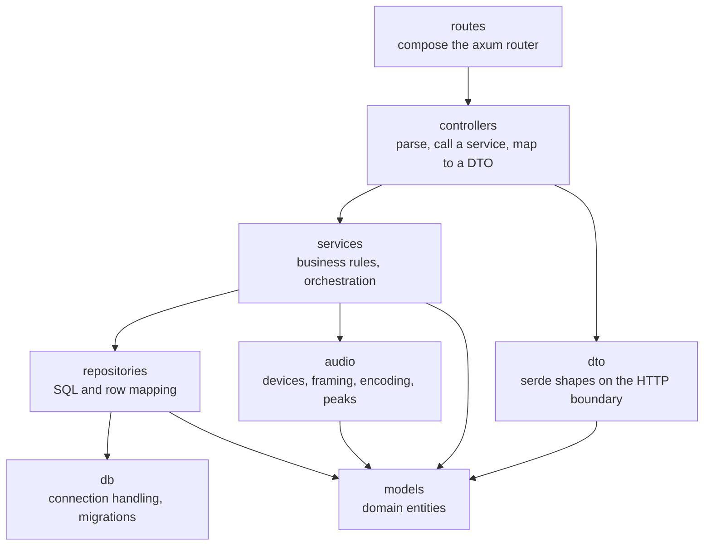
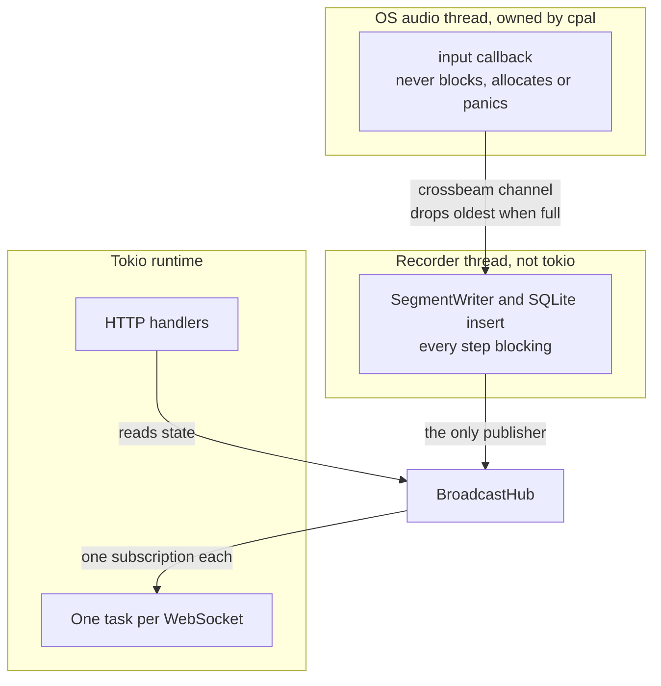
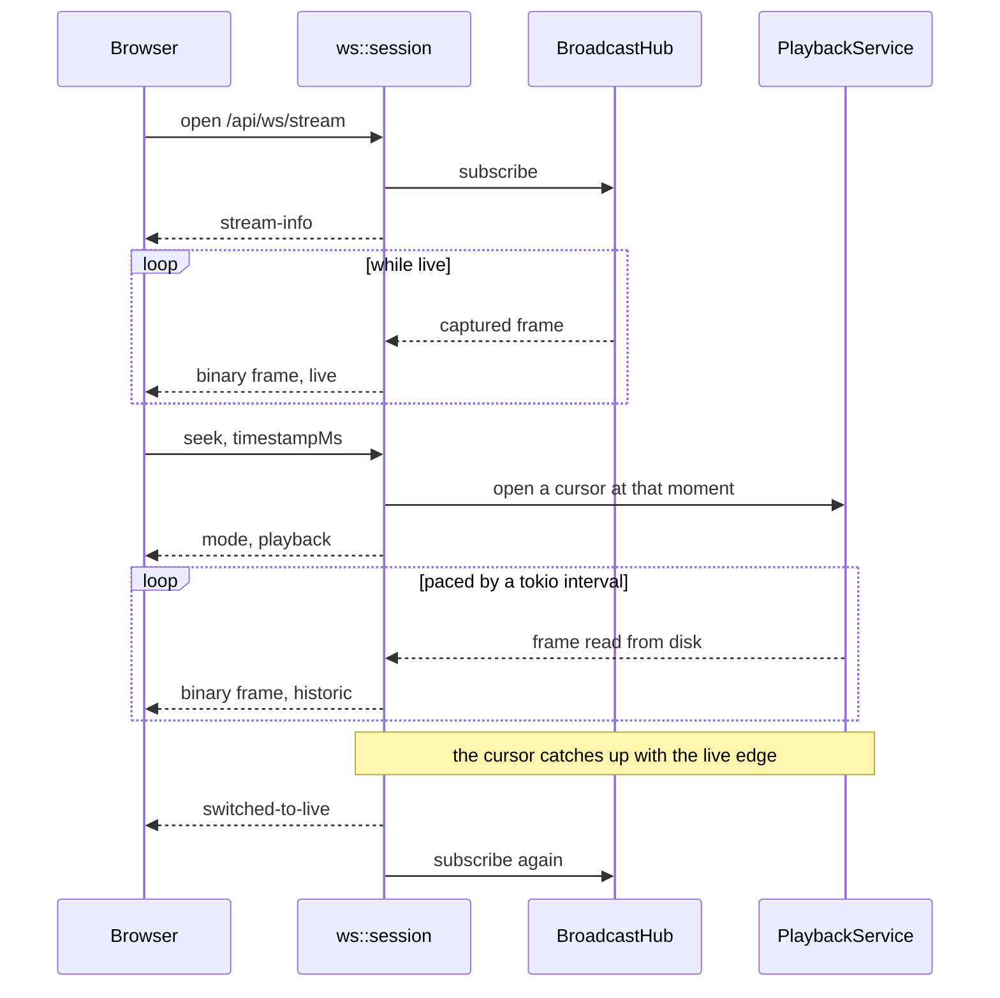
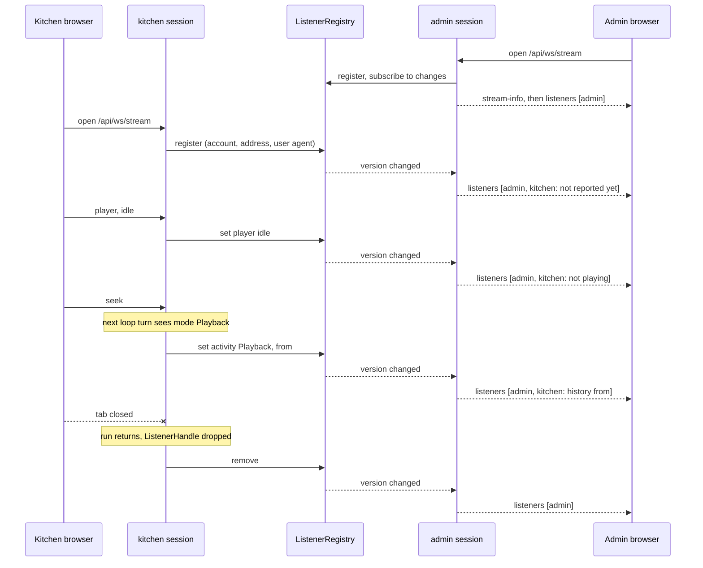

# Architecture

This document explains how On Air Record is put together, which layer owns which responsibility, and which
design patterns are used where. Read this before adding a feature so the new code lands in the right layer.

## 1. Two deployables, one process

The product is a single Rust binary plus a static React bundle that the binary serves. There is no separate
web server, no reverse proxy requirement, and no database server.

```
+--------------------------------------------------------------+
|  on-air-record binary                                         |
|                                                               |
|  axum HTTP server                                             |
|    /api/*        REST controllers                             |
|    /api/ws/*     WebSocket controllers                        |
|    /*            static file service (frontend/dist)          |
|                                                               |
|  background tasks                                             |
|    capture stream (cpal callback thread)                      |
|    segment recorder (tokio task)                              |
|    retention janitor (tokio interval task)                    |
|                                                               |
|  storage                                                      |
|    SQLite  data/on-air-record.sqlite                          |
|    PCM     data/recordings/<session>/<seq>.pcm                |
+--------------------------------------------------------------+
```

## 2. Backend layering

The backend follows a layered MVC style separation. Dependencies always point downwards, never sideways and
never upwards.



| Layer | Directory | Responsibility | May depend on |
| --- | --- | --- | --- |
| Routes | `src/routes` | Compose the axum router, mount middleware | Controllers |
| Controllers | `src/controllers` | Parse requests, call services, map to DTOs | Services, DTOs |
| DTOs | `src/dto` | Serde shapes crossing the HTTP boundary | Models |
| Services | `src/services` | Business rules, orchestration, background tasks | Repositories, audio, models |
| Audio | `src/audio` | Device access, framing, encoding, peaks | Models |
| Repositories | `src/repositories` | SQL statements, row mapping | Db, models |
| Db | `src/db` | Connection handling and migrations | - |
| Models | `src/models` | Domain entities, value objects | - |

The rule of thumb: a controller never writes SQL, a repository never knows about HTTP, and a service never
serialises JSON.

## 3. Design patterns in use

### Repository pattern (`src/repositories`)

Every table is reached through a repository object that owns SQL and row mapping. Controllers and services
speak in domain models such as `Segment` and `RecordingSession`, never in `rusqlite::Row`. This keeps the
storage engine swappable and makes the services testable with in memory doubles.

- `SettingsRepository` reads and writes the typed key value settings table.
- `SessionRepository` manages recording sessions (one per capture start).
- `SegmentRepository` indexes segment files and their peak envelopes.

### Service layer / facade (`src/services`, `src/app.rs`)

`AppState` is the composition root and the facade the controllers see. It is constructed once in `main.rs`,
wraps every service in `Arc`, and is handed to axum as shared state. Controllers therefore need one import
to reach the whole application.

### Observer / publish subscribe (`src/services/broadcast_hub.rs`)

`BroadcastHub` wraps a `tokio::sync::broadcast` channel of `AudioFrame` values. The capture service is the
single publisher. Live WebSocket sessions, the recorder, and the level meter are subscribers. Adding a new
consumer of live audio means subscribing to the hub, never modifying the capture code.

`ListenerRegistry` (`src/services/listener_registry.rs`) is the same idea for presence rather than audio:
every stream session is in it, and every admin session watches it. See
[Watching who is listening](#watching-who-is-listening) for how the two halves meet.

### RAII handle (`src/services/listener_registry.rs`)

`ListenerRegistry::register` returns a `ListenerHandle` whose `Drop` removes the entry. The session holds
it for exactly as long as `run` executes, so every way a session can end (a clean close, a network error, an
access check failing, a panic unwinding the task) takes it off the list. No code path has to remember to
unregister, which is the only way a presence list stays free of ghosts.

### Strategy (`src/audio/encoder.rs`)

`FrameEncoder` is a trait with `encode(&AudioFrame) -> Vec<u8>` plus format metadata. `PcmS16Encoder` is the
shipping implementation. A future Opus encoder implements the same trait and is selected by configuration,
so neither the recorder nor the streaming layer changes.

### State machine (`src/ws/session.rs`)

A streaming WebSocket session is a small state machine with three states, `Live`, `Playback`, and `Paused`,
driven by client control messages and by the playback cursor reaching the live edge. Keeping the transitions
in one enum avoids the tangle of booleans that DVR code usually grows.

### Actor per connection (`src/ws`)

Each WebSocket connection owns a tokio task, a `select!` loop over the inbound socket, the audio subscription,
and a pacing timer. Connections share no mutable state, so a slow listener cannot stall the recorder or the
other listeners. A lagging broadcast receiver is resynchronised rather than disconnected.

A connection also ends when its client vanishes without closing it, which TCP alone can take many minutes to
notice. Two limits cover the two ways that looks from inside the loop. The session pings on its 15 second
access check and drops a client it has not heard from, pongs included, for 45 seconds (`IDLE_TIMEOUT`).
And every write goes through `deliver`, which gives up after 20 seconds (`SEND_TIMEOUT`), because a
vanished client stops draining the socket and a send into a full buffer would otherwise wait forever inside
a branch, where the idle check never runs. Streaming live, the send limit fires first; paused, with nothing
but pings on the wire, the idle limit does.

### Builder (`src/config`)

`AppConfig` is assembled from defaults, then environment variables, then CLI flags, with each stage returning
the partially built config. That ordering is expressed once and is easy to extend.

### Data transfer objects (`src/dto`)

Wire shapes are separate types from domain models and are `camelCase` on the wire. Renaming a database column
therefore never breaks the frontend contract by accident.

## 4. Concurrency model

Three threads matter, and the arrows between them are the whole design. The recorder being the single
publisher into the hub is what guarantees a live listener hears exactly what was written to disk, in order.



- The `cpal` input callback runs on a realtime audio thread owned by the operating system. It must never
  block, allocate heavily, or touch SQLite. It only converts samples and does a non blocking send.
- A bounded `std::sync::mpsc` style channel (a `crossbeam` channel) hands frames from the audio thread to the
  async runtime. If the consumer falls behind, the oldest frames are dropped and a counter is incremented,
  which is reported as `droppedFrames` in the status API.
- Inside the runtime, `BroadcastHub` fans frames out to N subscribers. Broadcast lag is visible to each
  subscriber and is handled per connection.
- `ListenerRegistry` is a `std::sync::Mutex` around a map, held only for one insert, update or copy and
  never across an `await`. Changes are announced through a `tokio::sync::watch` channel carrying a version
  number rather than the list itself, so a change costs one increment however many admins are watching, and
  each watcher copies the map only when it wakes.
- SQLite is accessed through a single connection behind a mutex. Write volume is one row per segment (once
  every few seconds), so contention is not a concern, and it avoids the write lock errors that concurrent
  connections cause on some filesystems.

## 5. Frontend layering

```
src/
  api/         Transport only. REST client and the WebSocket wrapper.
  store/       Zustand stores. All shared mutable state lives here.
  lib/         Framework free helpers: audio scheduler, ring buffer, formatters.
  hooks/       React bindings that glue stores, transports, and effects together.
  components/  Presentational components, including the shadcn/ui primitives.
  features/    Feature folders that assemble components into panels.
  pages/       Route level composition.
```

Rules:

- Components never call `fetch` directly. They call a store action, which calls the API client.
- The Web Audio graph is never rebuilt by React rendering. It lives in `lib/audio` and is owned by a hook
  that mounts it once, because tearing an `AudioContext` down on every render causes clicks and drift.
- The graph plays through a hidden `<audio>` element rather than straight to the speakers, so phones treat
  the page as media and keep it playing with the screen off, with lock screen controls from the Media
  Session API. See [AUDIO_PIPELINE.md](AUDIO_PIPELINE.md#6-browser-playback).
- Zustand stores are sliced by concern so that a waveform repaint does not re render the settings panel:

  | Store | Owns |
  | --- | --- |
  | `useStatusStore` | Polled service and capture status, plus the record and stop actions |
  | `useConnectionStore` | WebSocket liveness, the negotiated stream format, the input meter |
  | `useTransportStore` | Play state, mode, volume, and the transport actions |
  | `useDeviceStore` | The host input list and the current selection |
  | `useSettingsStore` | Runtime preferences, plus the unsaved draft of the settings page |
  | `useTimelineStore` | The visible window, coverage bands, recorded days and the fetched envelope |
  | `useStorageStore` | Disk usage and recent sessions |
  | `useAccountsStore` | The account list on the settings page, plus its staged role changes |
  | `useListenersStore` | The realtime listener list pushed to admins over the stream socket |
- High frequency data (audio frames, level meters, playhead position at 60fps) bypasses React state and is
  pushed through refs and imperative canvas drawing. Only low frequency state changes go through Zustand.
- The settings page is explicit save. Edits accumulate in `useSettingsStore.draft`, which holds only the
  fields that differ from what is stored, so a value edited back to its original stops counting. One
  request commits the lot, and the server applies it atomically: a rejected recording directory leaves
  every other pending change unsaved rather than half applying them. The draft lives in the store, not the
  page, so navigating away and back does not discard work in progress.
- Account roles are staged the same way, in `useAccountsStore.roleDraft`, and `SettingsActionBar` counts,
  saves and discards both drafts together, so the page has one Save. Roles are separate requests to
  `PATCH /api/users/{id}`, sent promotions first because the server refuses to leave no admin, so handing
  the role over works in one save. Unlike settings they are not atomic as a set: each refused change stays
  staged with the server's reason in the bar. Adding, removing, passwords and 2FA resets are not staged;
  their dialog or confirm button is already the deliberate step.
- The imperative half of the transport is registered into the store rather than imported by it.
  `useStreamEngine` builds the socket and the audio graph, then calls `attachController`, so any component
  can call `seek` without being handed a WebSocket and the store stays free of side effects.

## 6. Data flow for the core scenarios

One socket carries all three of the first two scenarios, which is why the session is a state machine rather
than a set of flags:



### Listening live

1. UI opens `GET /api/ws/stream`.
2. Server subscribes the session to `BroadcastHub` and sends a `stream-info` control message.
3. Each capture frame is encoded, wrapped in the binary header, and pushed to the socket.
4. The browser scheduler queues each frame into an `AudioBufferSourceNode` at a computed start time, keeping
   a small jitter buffer so playback does not stutter.

### Seeking into history

1. UI sends `{"type":"seek","timestampMs":...}` on the same socket.
2. The session switches to the `Playback` state and asks `PlaybackService` for a segment cursor.
3. The cursor streams PCM from disk in frame sized chunks, paced by a tokio interval, flagged as historic.
4. When the cursor reaches the newest segment the session emits `switched-to-live` and rejoins the hub.

### Drawing the timeline

1. UI calls `GET /api/timeline/peaks?fromMs=..&toMs=..&buckets=..`.
2. `TimelineService` loads the overlapping segments, decodes their stored envelopes, and resamples them to
   the requested bucket count.
3. The canvas draws the envelope, the recorded coverage bands, the playhead, and the live edge.

The timeline is an overview plus detail pair. `TimelineScrubber` shows the window in detail and loses all
sense of where it sits; `TimelineMinimap` shows the surrounding calendar day with that window drawn on it,
and dragging it there calls `scrollTo`. The minimap is framed on a calendar day rather than a rolling
twenty four hours because an overview that slides as you pan gives you nothing to orient against. It reads
the same peaks endpoint at a coarser bucket count, so it costs one extra request per day rather than any
new backend surface.

The window is the only state the timeline really has, and every navigation is a transform of it: `panBy`
slides it, `scrollTo` positions it absolutely, `zoomTo` rescales it about an anchor, `showDay` fits it to a
day. The anchor is what stops
zooming from throwing away the moment the operator is looking at, so the toolbar passes the marker and the
scroll wheel passes the pointer. Any navigation to a specific moment also clears `followingLive`, or the
next range poll would drag the window back to the live edge and undo it.

### Watching who is listening

Every stream session registers itself in `ListenerRegistry` when it opens. The same sessions are also the
audience: a session whose user may see the list (`may_watch_listeners` in `ws/session.rs`: an admin, or
anyone on an open recorder) watches the registry and sends its browser a full copy whenever it changes.



Each entry carries two independent facts, because the server cannot see the second one:

- **`activity`**, what the session is streaming: `live`, `playback` (with where it started) or `paused`.
  The session loop compares it with what it last reported at the top of every turn, before `select!`,
  because several branches below `continue`. Only the kind of activity is compared, plus a flag set by
  `seek`, so a moving playhead does not republish the list ten times a second.
- **`player`**, what the browser says the person hears: `idle`, `playing` or `paused`, from the
  informational `player` client message. Browsers only allow audio after a click, and the UI's pause button
  suspends the `AudioContext` without telling the server, so from the server's side an untouched tab and a
  paused one both look live. The UI sends it on every connect, because a reconnect is a new session, and on
  every change of `useTransportStore.playing`. It is taken off before `handle_command`, so it can never
  affect the transport. A client that never sends it is listed as `playing`.

The frontend labels a tab from both: `player` first (`Not playing`, `Paused`), then `activity` (`Live`,
`History from`, `Paused`), in `describeActivity` and `activityTone` in `lib/listeners.ts`.

Whether a session may see the list is decided at connect and again on the existing 15 second access check.
Losing it sends `listeners-hidden` and stops watching; gaining it sends a list at once. A listener's
session never subscribes, so it cannot receive the list even by a bug in the frontend.

The list is always sent whole, never as a difference: at household sizes it is a few hundred bytes, and a
client that missed a message has nothing to reconcile. The registry is also the listener count in
`GET /api/status`, because `BroadcastHub` only counts sessions on the live feed and someone listening back
through history is a listener too.

## 7. Extension points

| I want to | Touch this |
| --- | --- |
| Add a REST endpoint | `dto`, `controllers`, `routes` |
| Add a shadcn primitive | Copy it into `components/ui`, styling it against the theme tokens rather than importing a library stylesheet |
| Offer a new way to navigate history | `TimelineService`, `dto/timeline_dto.rs`, `useTimelineStore`, a component under `features/timeline` |
| Add a stored preference | `models/settings.rs`, `repositories/settings_repository.rs`, settings DTO, frontend `settingsStore` |
| Support a new codec | Implement `FrameEncoder`, register it in `audio::encoder::build_encoder` |
| Add a live audio consumer | Subscribe to `BroadcastHub`, nothing else |
| Show something new about each listener | `models/listener.rs`, `ListenerView` in `ws/messages.rs` and `api/types.ts`, `lib/listeners.ts`, `features/status/ListenersBadge.tsx`. If the value changes during a session, give `ListenerHandle` a setter that goes through `ListenerRegistry::modify` so unchanged values wake nobody |
| Change who may see the listener list | `may_watch_listeners` in `ws/session.rs`, and the matching test there |
| Change the storage backend | Reimplement the repository traits, leave the services alone |

## 8. Testing

The backend carries unit tests next to the code they cover, run with `cargo test` from `backend/`. They
concentrate on the parts where a mistake is silent rather than loud: timestamp arithmetic in the frame
builder, byte offset maths in `Segment`, the segment index queries, envelope rendering, and the playback
cursor stepping across a real data directory of real PCM files.

The listener list is tested in layers. `listener_registry.rs` proves entries leave with their handle and
that only real changes wake watchers; `ws/session.rs` proves who may see the list across open, admin,
listener, promotion and demotion against a real temp data directory; `ws/messages.rs` pins the wire shapes.

The frontend tests the framework free half with `npm test` (Vitest) from `frontend/`: the binary frame
decoder, the timeline geometry, the formatters, the listener grouping and labels in `lib/listeners.ts`,
and the Zustand slices. Components are not unit tested, because what would
break in them is canvas drawing and Web Audio scheduling, and neither is meaningfully exercised in jsdom.
Those are verified by running the service and listening.
