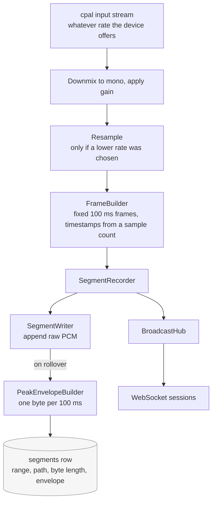
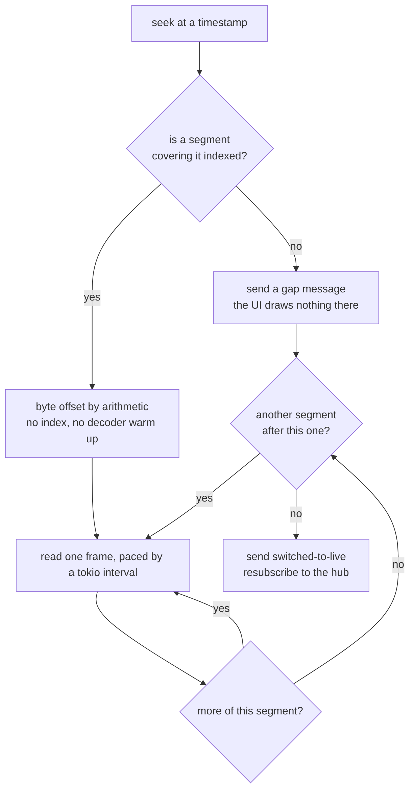

# Audio pipeline

Everything about how a sound wave becomes bytes, reaches the browser, and comes back out of the timeline.



Two properties of that picture are load bearing. The recorder is the **only** publisher into the hub, so a
live listener hears exactly what reached the disk, in the same order. And the envelope is computed during
recording, while the samples are still in cache, rather than by re reading the file later.

## 1. Capture

`cpal` is the cross platform audio layer. It uses CoreAudio on macOS, ALSA on Linux, and WASAPI on Windows.

Device negotiation:

1. The configured device id (a stable name string) is looked up in the host device list.
2. If it is missing, the system default input device is used and a warning is logged.
3. The default input config of that device decides the sample rate and channel count. We do not force a
   sample rate, because forcing one makes some USB interfaces refuse to open.
4. The sample format may be `f32`, `i16`, or `u16`. All three are handled and normalised to `f32` in the
   callback.

Normalisation in the callback:

- Interleaved multi channel input is downmixed to mono by averaging the channels. Mono halves the bandwidth
  and the disk usage, and a broadcast monitor feed does not need a stereo image.
- Software gain is applied as a plain multiplier and the result is clamped to `[-1.0, 1.0]`.
- Samples are converted to signed 16 bit little endian, which is the wire and disk format.

The callback never allocates a growing buffer, never locks a mutex held by another subsystem, and never
touches SQLite. It fills a reusable buffer and does one non blocking channel send.

### Recording rate

The `recording_sample_rate` setting downsamples before framing, so the frame builder, the segment index,
the wire protocol and the browser all see one rate: the one being recorded. Uncompressed PCM means the
rate is the bit rate, `sample_rate * 16` for mono, and the disk cost scales exactly with it.

| Setting | Rate | Bit rate | Per hour |
| --- | --- | --- | --- |
| Full quality | 48 kHz | 768 kbps | 330 MiB |
| High | 32 kHz | 512 kbps | 220 MiB |
| Good | 24 kHz | 384 kbps | 165 MiB |
| Voice | 16 kHz | 256 kbps | 110 MiB |
| Telephone | 8 kHz | 128 kbps | 55 MiB |

Downsampling is a fourth order low pass followed by linear interpolation, both allocation free so they run
on the callback thread. The filter is the part that matters: without it every frequency above the new
Nyquist folds back into the audible band as aliasing, which sounds far worse than the lost treble that
filtering costs. Linear interpolation is chosen over a windowed sinc because the filter has already
removed the content its error would be most audible on, and a polyphase resampler would need buffering
that does not fit a callback delivering variable chunk sizes.

A rate above what the device produces is ignored: upsampling invents no detail and doubles the disk. Each
segment records the rate it was captured at, so changing the setting never affects existing recordings and
playback moves between rates without a gap.

## 2. Framing

Audio is cut into frames of a fixed duration, 100 milliseconds by default.

```
frame_samples = sample_rate * frame_ms / 1000
frame_bytes   = frame_samples * 2        (mono, 16 bit)
```

At 48 kHz that is 4800 samples and 9600 bytes per frame, which is roughly 94 KiB/s of audio, comfortable for
a LAN and small enough that the added latency is not noticeable.

Each frame carries a wall clock timestamp in milliseconds since the Unix epoch, taken when the frame is
completed and then corrected by the frame duration so it marks the start of the frame. Timestamps are the
backbone of the DVR: they are what the timeline, the segment index, and seeking are all expressed in.

### Timestamp drift

The operating system clock and the audio clock run at slightly different speeds. Rather than trusting either
one alone, the capture service anchors the first frame to the wall clock and then derives every subsequent
timestamp from the accumulated sample count. If the derived timestamp drifts more than 500 ms from the wall
clock, the anchor is reset and the drift is logged. This keeps long running sessions from slowly sliding away
from real time while avoiding jitter from clock reads.

## 3. Wire protocol

Audio frames travel as binary WebSocket messages with a 24 byte little endian header.

| Offset | Size | Type | Field |
| --- | --- | --- | --- |
| 0 | 4 | u32 | Magic `0x3152414F` (the bytes `OAR1`) |
| 4 | 1 | u8 | Protocol version, currently `1` |
| 5 | 1 | u8 | Frame type, `0` = PCM signed 16 bit |
| 6 | 1 | u8 | Channel count |
| 7 | 1 | u8 | Flags, bit 0 set means live, clear means historic |
| 8 | 4 | u32 | Sample rate in Hz |
| 12 | 4 | u32 | Sample count per channel |
| 16 | 8 | i64 | Frame start timestamp, milliseconds since the Unix epoch |

The payload follows immediately: `sample_count * channels` signed 16 bit little endian samples.

Control messages on the same socket are JSON text messages, so a client can tell them apart from audio by
the WebSocket frame type alone. They are documented in [API.md](API.md).

## 4. Storage

### Segment files

Segments are raw headerless PCM, exactly the payload format described above, appended in order.

```
data/recordings/<YYYY-MM-DD>/<session_id>/<sequence>.pcm
```

The root is `<data dir>/recordings` unless the `recordings_dir` setting points elsewhere, in which case
that directory takes the place of the `recordings` component. Which root a session uses is fixed when it
starts, so changing the setting never scatters one recording across two places.

Segments written to the default root are indexed with a path relative to the data directory, keeping the
whole directory relocatable. Segments written to a chosen root are indexed absolutely, because a relative
path would have nothing to be relative to. Resolution keys off `Path::is_absolute`, so rows written by any
earlier version keep working without a migration.

Day first, session second. Grouping by day is what makes the directory browsable by hand and lets a day's
audio be archived or deleted as a unit, and it keeps a single day's material together even when the
recorder was stopped and restarted several times within it. The day is the host's **local** calendar day,
decided by where the segment *starts*, so a segment straddling midnight belongs to the day it began in.
Playback does not care, because it is driven by timestamps rather than by day boundaries, so audio crosses
midnight seamlessly.

Raw PCM was chosen for the first release because it is seekable by arithmetic. The byte offset of any
timestamp inside a segment is a multiplication, with no index and no decoder state, which is what makes
instant scrubbing cheap. The cost is size, roughly 338 MiB per hour at 48 kHz mono, which the retention
window bounds. Compression is a planned milestone and is isolated behind the `FrameEncoder` strategy.

### Segment index

One SQLite row per closed segment:

| Column | Meaning |
| --- | --- |
| `id` | Auto increment primary key |
| `session_id` | Owning capture session |
| `day` | Local calendar day, `YYYY-MM-DD`, denormalised from `started_at_ms` |
| `sequence` | Zero based index inside the session |
| `path` | Path relative to the data directory |
| `started_at_ms` / `ended_at_ms` | Inclusive start, exclusive end, in epoch milliseconds |
| `sample_rate` / `channels` | Format needed to interpret the file |
| `byte_len` | File size, used for storage reporting and integrity checks |
| `peaks` | Peak envelope blob, see below |

The `day` column is written from the same value that built the path, so a segment's day always names the
directory its file is actually in. It is stored rather than computed on read for two reasons: it can be
indexed, and it pins the grouping to the timezone in force when the audio was captured, so changing the
host timezone later does not silently reshuffle old recordings into different days than their folders.

Segments are 10 seconds by default. Shorter segments mean more rows and more file handles, longer ones mean
more data lost if the process is killed mid segment, since only closed segments are indexed. The recorder
also flushes and indexes the open segment on graceful shutdown.

### Peak envelope

While writing, the recorder accumulates amplitude statistics per 100 ms bucket and stores them as one byte
per bucket: the RMS of the bucket scaled to `0..255`. A 10 second segment therefore carries 100 bytes of
envelope. Drawing an hour of timeline reads 360 rows and 36 KB of envelope rather than 338 MiB of audio.

Buckets are aligned to the segment start, not to the wall clock, and the segment start timestamp is stored,
so the renderer can map bucket index to absolute time exactly.

### Export

A WAV export is the same segments with a 44 byte header in front, because they already hold exactly the
sample format a canonical WAV carries. Nothing is transcoded unless the range spans two recording rates,
in which case the higher material is downsampled to the lowest rate present.

The header has to state the data length before any audio is sent, which is only possible because
uncompressed audio has an exactly predictable size: the range duration times the rate times the sample
width. The whole plan is therefore decided, and can be refused, before the first byte goes out. Gaps are
filled with silence so the promised length is always met, whatever the recorder was doing.

Reading happens on the blocking pool and reaches the socket through a bounded channel, so a large export
neither stalls the recorder nor lets a client that stops reading make the server buffer the file in
memory.

## 5. Playback and the DVR cursor

`PlaybackService::cursor_at(timestamp)` builds an iterator over the segments that cover the requested time,
ordered by start time, and positions the read head inside the first one:

```
byte_offset = ((timestamp_ms - segment.started_at_ms) * sample_rate / 1000) * 2 * channels
```

The offset is aligned down to a sample boundary. The cursor then reads frame sized chunks and yields them
with reconstructed timestamps.

Pacing is done by a tokio interval that ticks once per frame duration divided by the playback speed, so
speed costs nothing but a different timer period. The client matches it by setting `playbackRate` on each
buffer, which shifts pitch along with tempo the way tape does. Preserving pitch would need a phase vocoder,
which is a great deal of machinery for a control whose job is scanning through recordings. This is deliberately simple: the
client keeps its own jitter buffer, so the server does not need to be sample accurate, it only needs to
deliver on average one frame of audio per frame of wall clock time.

Gap handling: recording gaps are real, for example when the service was stopped or the device was swapped.
The cursor reports a gap instead of silently skipping it, the session sends a `gap` control message, and the
UI shows the timeline as empty there rather than pretending audio existed.

Live handoff: when the cursor reaches the end of the newest segment, the session sends `switched-to-live` and
resubscribes to `BroadcastHub`. There is a small overlap because the open segment is not on disk yet, so the
session skips forward to the live edge rather than replaying it.



## 6. Browser playback

The browser cannot simply `decodeAudioData` a stream of raw PCM frames, so playback is scheduled manually.

1. Each received frame is converted from `Int16Array` to `Float32Array` divided by `32768`.
2. An `AudioBuffer` is created at the frame's sample rate and filled. The Web Audio graph resamples it to the
   `AudioContext` rate automatically, which is why the server does not need to resample.
3. The buffer is scheduled with `source.start(playAt)` where `playAt` is the running scheduling clock, not
   `currentTime`. The scheduling clock starts at `currentTime + jitterBufferSeconds` and then advances by
   exactly the duration of every scheduled buffer, which produces gapless playback.
4. If the scheduling clock falls behind `currentTime`, the buffer would be scheduled in the past, so the
   clock is resynchronised and a drop is counted. This happens after a tab is backgrounded or the network
   stalls, and recovering with a short gap is better than accumulating unbounded latency.
5. An `AnalyserNode` on the output feeds the live waveform visualiser, and a `GainNode` provides the volume
   control and the mute button.

6. The graph ends not at the speakers but at a `MediaStreamAudioDestinationNode`, played by a hidden
   `<audio>` element. Phones keep a page running with the screen off only while it plays media through an
   element; pure Web Audio is suspended when the screen locks. Playing through an element makes the page a
   media player, which is also what lock screen controls attach to (`lib/audio/mediaSession.ts`). On Safari
   the engine also sets `navigator.audioSession.type = "playback"`. Where the element cannot play, the
   graph is connected to `context.destination` instead, exactly as before, so no browser loses sound.
7. In every browser except Apple's WebKit the engine also loops a ten second silent WAV, built in memory by
   `lib/audio/silence.ts`, in a second element. Chrome keeps a MediaStream element playing with the screen
   off but, treating it like a video call, never gives it media controls: not the notification and lock
   screen on Android, not the toolbar media button or the system Now Playing on a computer. It shows them
   only for an unmuted element with a known duration of at least five seconds. The silent clip is that
   element, and the controls then carry the Media Session metadata and buttons. The session declares an
   infinite duration so the clip's ten seconds are not drawn as a progress bar. WebKit, which is every
   browser on an iPhone or iPad and Safari on a Mac, shows controls for the stream element itself.

Browsers block audio until a user gesture, so the `AudioContext` is created suspended and resumed on the
first click on the play control. The hidden element's `play()` is called synchronously inside that click,
before any `await`, because phones allow media to start only while the gesture is still being handled.

If the phone pauses the element on its own, for another app or a call, the engine reports it and the
transport pauses, so the page and the lock screen stop claiming to play. When the page becomes visible again
while the listener still wants sound, the engine tries to resume the context and the element; some phones
insist on a fresh tap, and then the play button is the way back.

## 7. Latency budget

| Stage | Typical |
| --- | --- |
| Device buffer | 10 to 30 ms |
| Frame accumulation | 100 ms |
| Hub fan out and socket write | under 5 ms on a LAN |
| Browser jitter buffer | 150 ms default |
| Web Audio output buffer | 10 to 25 ms |
| Media element output | Browser dependent, not yet measured |
| **Total** | **roughly 300 to 350 ms** |

The playhead is read from the `AudioContext` clock, so whatever the media element adds on top is not in it:
the playhead runs that far ahead of what is heard.

That is well inside what a monitoring or broadcast style application needs. Reducing the frame size to 20 ms
and the jitter buffer to 60 ms gets it under 150 ms at the cost of more overhead per frame and less tolerance
for a busy network.
