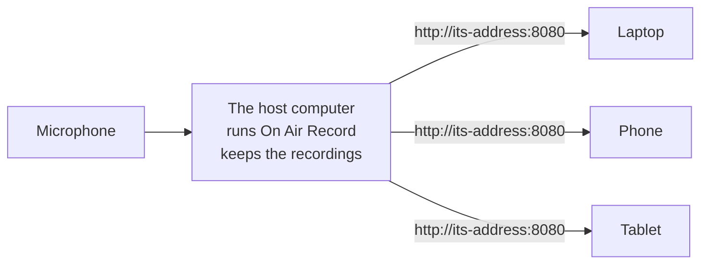

<!--
  This file is published to the GitHub wiki by .github/workflows/wiki.yml on every push to master, which
  rewrites the links between documents on the way. Images are linked by absolute raw.githubusercontent URL
  rather than by relative path, because the wiki is a separate repository and cannot see docs/images.
-->

# Installation and setup

This page is for whoever puts On Air Record on a machine and gets it running. Once it is running, the
[user guide](USER_GUIDE.md) covers how to actually use it.

You install it on **one** computer, the one with the microphone. Everybody else just opens a web address.
Nothing has to be installed on the listening devices.



## Contents

- [What you need](#what-you-need)
- [The quick way](#the-quick-way)
- [Stopping it](#stopping-it)
- [Step 1: download](#step-1-download)
- [Step 2: run it](#step-2-run-it)
- [Step 3: open it](#step-3-open-it)
- [Choosing a port](#choosing-a-port)
- [All the settings you can pass at start up](#all-the-settings-you-can-pass-at-start-up)
- [Where the recordings are written](#where-the-recordings-are-written)
- [Keeping it running: macOS](#keeping-it-running-macos)
- [Keeping it running: Linux](#keeping-it-running-linux)
- [Keeping it running: Windows](#keeping-it-running-windows)
- [Letting other machines reach it](#letting-other-machines-reach-it)
- [Upgrading](#upgrading)
- [Uninstalling](#uninstalling)
- [Building from source](#building-from-source)
- [Publishing a release](#publishing-a-release)
- [Setup problems](#setup-problems)
- [Reporting a problem](#reporting-a-problem)
- [Credits](#credits)

## What you need

- A computer that stays switched on: macOS, Linux, or Windows. It does not need to be powerful.
- A microphone it can hear. Built in is fine.
- Disk space. Roughly **330 MB per hour** at full quality, or **110 MB per hour** at voice quality. How
  much you need in total depends on how far back you want to be able to listen, and the app works that
  figure out for you on its settings page.
- A network the listeners are also on.

Nothing else. There is no database to install, no runtime, no web server. The whole thing is one file.

## The quick way

One command does all three steps below. Run it from whatever folder you want the installation to live in.

**macOS and Linux**, in a terminal:

```sh
curl -fsSL https://raw.githubusercontent.com/shibbirweb/on-air-record/master/scripts/install.sh | sh
```

**Windows**, in PowerShell:

```powershell
irm https://raw.githubusercontent.com/shibbirweb/on-air-record/master/scripts/install.ps1 | iex
```

It works out which build your machine needs, downloads the latest release, checks it against the published
checksum, asks which port to use, and starts the service. Everything lands in one `on-air-record` folder
created right there:

```
on-air-record/
  on-air-record     the program
  start.sh          starts it again with your settings   (start.cmd on Windows)
  config            your settings
  data/             recordings and the database
```

Nothing is written anywhere else on the machine. To start it again later:

```sh
./on-air-record/start.sh          # macOS and Linux
```

```powershell
.\on-air-record\start.cmd         # Windows, or just double click it in Explorer
```

That reads `config`, so the port is only chosen once. Useful options:

| macOS and Linux | Windows | What it does |
| --- | --- | --- |
| `--port 9000` | `-Port 9000` | Use this port without asking |
| `--release v0.1.0` | `-Release v0.1.0` | Install that exact version instead of the newest |
| `--reconfigure` | `-Reconfigure` | Ask for the port again |
| `--update` | `-Update` | Fetch a newer release over the top |
| `--no-start` | `-NoStart` | Install and configure, but do not start |
| `--dir <path>` | `-Dir <path>` | Install somewhere other than the current folder |

On macOS and Linux, pass them after `--`:

```sh
curl -fsSL https://raw.githubusercontent.com/shibbirweb/on-air-record/master/scripts/install.sh | sh -s -- --port 9000
```

On Windows, `iex` cannot take parameters, so use the script block form:

```powershell
& ([scriptblock]::Create((irm https://raw.githubusercontent.com/shibbirweb/on-air-record/master/scripts/install.ps1))) -Port 9000
```

This also sidesteps the "unidentified developer" warning on macOS and SmartScreen on Windows, because a
file fetched with `curl` or `irm` is not quarantined the way a browser download is. Windows will still ask
about the firewall the first time the service starts; say yes for private networks.

It will refuse to run on ARM Linux, such as a Raspberry Pi, because there is no prebuilt binary for it.
That needs [building from source](#building-from-source).

The rest of this section is the same thing done by hand.

## Stopping it

While the terminal that started it is still open, **Ctrl+C** stops it cleanly.

Once that terminal is gone, or if you started it and closed the window without the service noticing, use
the stop script that sits beside the program:

```sh
./on-air-record/stop.sh            # macOS and Linux
```

```powershell
.\on-air-record\stop.cmd           # Windows, or double click it in Explorer
```

It only stops the service started from **that folder**, so a second copy installed somewhere else keeps
running. It reports what it stopped, or says nothing was running, which is not an error.

### If you have lost the folder

Find it by the port it is serving on:

```sh
# Linux
sudo ss -lptn 'sport = :8080'

# macOS
sudo lsof -i :8080

# then, with the process id from that
kill <pid>
```

```powershell
# Windows
Get-Process on-air-record | Format-Table Id, Path
Stop-Process -Name on-air-record
```

**Use a plain `kill`, not `kill -9`.** The service closes and indexes the segment it is part way through
writing when it is asked to stop politely, so the last few seconds stay playable. `kill -9` throws them
away. Only force it if a plain `kill` has had twenty seconds and done nothing.

Windows has no polite equivalent for a console program, so `stop.cmd` is a hard stop there and does lose
the few seconds not yet written out. Ctrl+C in the window keeps them.

### Stopping recording is not the same as stopping the service

The **Stop** button in the Recorder panel of the web interface stops *recording*. The service keeps
running and keeps serving the page, so you can still listen back to everything already recorded. That
button is for pausing the recorder, not for shutting the machine down.

## Step 1: download

Go to the **Releases** page of the repository and download the file for your machine.

| Your machine | File to download |
| --- | --- |
| Mac with Apple silicon (M1 and later) | `on-air-record-<version>-aarch64-apple-darwin.tar.gz` |
| Mac with an Intel processor | `on-air-record-<version>-x86_64-apple-darwin.tar.gz` |
| Linux, 64 bit Intel or AMD | `on-air-record-<version>-x86_64-unknown-linux-gnu.tar.gz` |
| Windows, 64 bit | `on-air-record-<version>-x86_64-pc-windows-msvc.zip` |

Not sure which Mac you have? Apple menu, About This Mac. Anything that says Apple M1, M2, M3 or later needs
the `aarch64` file.

There is no prebuilt file for ARM Linux, such as a Raspberry Pi. That works, but you have to
[build it from source](#building-from-source).

Each download has a `.sha256` file next to it if you want to check it arrived intact:

```sh
# macOS and Linux
shasum -a 256 -c on-air-record-<version>-<target>.tar.gz.sha256
```

```powershell
# Windows
Get-FileHash on-air-record-<version>-x86_64-pc-windows-msvc.zip -Algorithm SHA256
```

## Step 2: run it

The web interface is built into the program, so there is nothing to unpack beyond the archive itself and
nothing to point it at.

### macOS

```sh
tar -xzf on-air-record-<version>-aarch64-apple-darwin.tar.gz
cd on-air-record-<version>-aarch64-apple-darwin
./on-air-record
```

Two things happen on a Mac the first time, both of them normal:

1. **macOS blocks the download.** It was not downloaded from the App Store and is not signed, so you get
   a warning. Open System Settings, Privacy and Security, scroll to the bottom, and press **Open Anyway**
   next to the message about `on-air-record`. Then run it again.
2. **macOS asks for the microphone.** Allow it. If you miss the prompt or refuse it, the app runs but sees
   no microphones at all, which looks like broken hardware. Fix it under System Settings, Privacy and
   Security, Microphone, then start the app again.

Run it once by hand like this before setting it up to start automatically, because a background service
never gets shown that microphone prompt.

### Linux

ALSA is how Linux hands out audio, and the program loads its shared library at run time. Desktop systems
already have it. A minimal server may not, in which case the program fails to start with a message about
`libasound.so.2`. Install it with whichever name your distribution uses:

```sh
sudo apt install libasound2t64 || sudo apt install libasound2   # Debian, Ubuntu, Raspberry Pi OS
sudo dnf install alsa-lib                                        # Fedora, RHEL
```

Then:

```sh
tar -xzf on-air-record-<version>-x86_64-unknown-linux-gnu.tar.gz
cd on-air-record-<version>-x86_64-unknown-linux-gnu
./on-air-record
```

Check the machine can actually see a microphone with `arecord -l`. If that lists nothing, the app will list
nothing either, and the problem is the operating system rather than the app.

Your user account has to be in the `audio` group to reach the sound hardware. Desktop accounts usually are
already. If not:

```sh
sudo usermod -aG audio "$USER"
# log out and back in for the group to take effect
```

### Windows

Unzip the file, open the folder, and double click `on-air-record.exe`. A console window opens and stays
open. That window **is** the service: closing it stops the recording.

Two things to expect:

1. **SmartScreen warns you.** Press More info, then Run anyway.
2. **Windows Firewall asks whether to allow it.** Say yes for private networks, or nothing else on your
   network will be able to connect. If you dismissed that prompt, see
   [Letting other machines reach it](#letting-other-machines-reach-it).

Windows is built and tested automatically on every change, but nobody has yet sat at a Windows desktop and
listened to it end to end. It should work; you may be the first to find out.

## Step 3: open it

Whatever the platform, the program prints the address it is listening on when it starts:

```
INFO on_air_record: control room ready on http://0.0.0.0:8080
```

`0.0.0.0` means "every network connection this machine has", not a literal address you can type. On the
machine itself, open:

```
http://localhost:8080
```

You should see this:


From another device on the same network, use the host machine's address on the network:

```sh
# macOS: find the address of whichever interface is actually in use
ipconfig getifaddr "$(route -n get default | awk '/interface:/{print $2}')"

# Linux
hostname -I

# Windows: look for IPv4 Address under your active adapter
ipconfig
```

Then open `http://<that-address>:8080` from the phone, tablet or laptop. Give that address to anyone who
needs to listen.

## Choosing a port

8080 is only the default. Change it with `--port` on the command line:

```sh
# macOS and Linux
./on-air-record --port 9000
```

```powershell
# Windows
.\on-air-record.exe --port 9000
```

or with the `OAR_PORT` environment variable, which is the easier one to use with a service manager that
does not let you edit the command line:

```sh
# macOS and Linux
OAR_PORT=9000 ./on-air-record
```

```powershell
# Windows, for this console window only
$env:OAR_PORT = "9000"
.\on-air-record.exe
```

**If you set both, the command line wins.** That is deliberate, so you can override a service's configured
port for one run without editing the service.

Reasons to change it:

- **Something else already uses 8080.** It is a popular port. If it is taken, the app refuses to start and
  says so rather than failing quietly:
  ```
  ERROR on_air_record: could not bind the http listener error=Address already in use (os error 48) address=0.0.0.0:8080
  ```
  Pick another number and try again.
- **You want a memorable number** to give people, such as 8000 or 9000.
- **You want to run two copies**, for example a test one alongside the real one. Give each its own port
  **and its own data directory**, or they will fight over the same database.

Pick a number between 1024 and 65535. Below 1024 needs administrator rights on macOS and Linux and is not
worth the trouble.

Whatever you choose, the address becomes `http://<host>:<your port>`, and it has to be included: browsers
assume port 80 when you leave it out.

## All the settings you can pass at start up

Every option can be given as a command line flag or as an environment variable. The flag wins if you use
both. Run `on-air-record --help` to see this list on the machine itself.

| Flag | Environment variable | Default | What it does |
| --- | --- | --- | --- |
| `--port` | `OAR_PORT` | `8080` | The port the web interface is served on. |
| `--host` | `OAR_HOST` | `0.0.0.0` | Which network connections to accept. `0.0.0.0` means all of them. Use `127.0.0.1` to allow only the machine itself. |
| `--data-dir` | `OAR_DATA_DIR` | `./data` | Where recordings and the database are kept. |
| `--static-dir` | `OAR_STATIC_DIR` | `../frontend/dist` | A folder holding a web interface to serve instead of the built in one. You do not normally need this. |
| `--log-level` | `OAR_LOG_LEVEL` | `info` | How much detail is printed: `error`, `warn`, `info`, `debug` or `trace`. Use `debug` when reporting a problem. |

A complete example:

```sh
./on-air-record --port 9000 --data-dir /srv/on-air-record --log-level debug
```

The same thing with environment variables:

```sh
OAR_PORT=9000 OAR_DATA_DIR=/srv/on-air-record OAR_LOG_LEVEL=debug ./on-air-record
```

Everything else, such as which microphone to use, how long to keep recordings and at what quality, is
changed on the app's own settings page while it is running. It is remembered between restarts, so it does
not belong on the command line. The [user guide](USER_GUIDE.md#settings) covers those.

## Where the recordings are written

By default, in a folder called `data` **next to wherever you happened to run the program from**, not next
to the program itself. Start it from a different folder and it will look like it has lost all its
recordings, when in fact it has made a second empty `data` folder somewhere else.

Avoid that by always giving it a full path:

```sh
# macOS and Linux
./on-air-record --data-dir /srv/on-air-record

# Windows
.\on-air-record.exe --data-dir C:\on-air-record\data
```

That folder ends up holding:

```
<data-dir>/
  on-air-record.sqlite     the settings, and the index of what was recorded when
  recordings/              the audio itself, in a folder per day
```

Point it at a disk with room. If the disk fills up, recording stops. The app's settings page will estimate
how much you need for the history you want to keep, and it deletes its own old recordings to stay inside
that limit.

The recordings folder can be moved somewhere else later from the settings page without restarting, and
without losing what has already been recorded.

## Keeping it running: macOS

For a machine that is always on, run it with `launchd`.

Run it by hand once first and allow the microphone prompt, otherwise a background job will silently find
no microphones.

Create `~/Library/LaunchAgents/com.onairrecord.plist`:

```xml
<?xml version="1.0" encoding="UTF-8"?>
<!DOCTYPE plist PUBLIC "-//Apple//DTD PLIST 1.0//EN" "http://www.apple.com/DTDs/PropertyList-1.0.dtd">
<plist version="1.0">
<dict>
  <key>Label</key>
  <string>com.onairrecord</string>
  <key>ProgramArguments</key>
  <array>
    <string>/usr/local/bin/on-air-record</string>
    <string>--port</string>
    <string>8080</string>
    <string>--data-dir</string>
    <string>/Users/YOUR-NAME/on-air-record/data</string>
  </array>
  <key>RunAtLoad</key>
  <true/>
  <key>KeepAlive</key>
  <true/>
  <key>StandardErrorPath</key>
  <string>/tmp/on-air-record.log</string>
</dict>
</plist>
```

Then:

```sh
sudo cp on-air-record /usr/local/bin/
launchctl load ~/Library/LaunchAgents/com.onairrecord.plist
```

Use a **LaunchAgent** in your own home folder as shown, not a system wide LaunchDaemon. Microphone
permission on macOS belongs to a logged in user, and a daemon running as the system has no user to have
been granted it. The cost is that recording only runs while you are logged in.

## Keeping it running: Linux

The repository ships a systemd unit at
[`packaging/on-air-record.service`](../packaging/on-air-record.service), and it is included in the Linux
release archive. Its header comment carries the full install sequence. In short:

```sh
sudo install -m 755 on-air-record /usr/local/bin/on-air-record
sudo useradd --system --home /var/lib/on-air-record --shell /usr/sbin/nologin on-air-record
sudo usermod -aG audio on-air-record
sudo install -d -o on-air-record -g on-air-record /var/lib/on-air-record
sudo install -m 644 on-air-record.service /etc/systemd/system/
sudo systemctl daemon-reload
sudo systemctl enable --now on-air-record
```

**The `usermod -aG audio` line is the one people miss.** Without it the service starts, serves the web
interface, and lists no microphones at all, which looks like a hardware fault rather than a permissions
one.

To change the port or the data directory, edit the `Environment=` lines in the unit file:

```ini
Environment=OAR_DATA_DIR=/var/lib/on-air-record
Environment=OAR_HOST=0.0.0.0
Environment=OAR_PORT=8080
```

then reload and restart:

```sh
sudo systemctl daemon-reload
sudo systemctl restart on-air-record
```

Useful afterwards:

```sh
systemctl status on-air-record     # is it running
journalctl -u on-air-record -f     # watch the log
sudo systemctl stop on-air-record  # stop recording
```

## Keeping it running: Windows

There is no service wrapper built into the program, because an untested code path would be worse than a
documented command. Use one of the two standard tools.

**[NSSM](https://nssm.cc/) is the better option.** It supervises an ordinary console program properly,
restarts it if it stops, and captures its output to a log:

```powershell
nssm install OnAirRecord C:\on-air-record\on-air-record.exe
nssm set OnAirRecord AppParameters "--port 8080 --data-dir C:\on-air-record\data"
nssm set OnAirRecord AppStdout C:\on-air-record\service.log
nssm set OnAirRecord AppStderr C:\on-air-record\service.log
nssm start OnAirRecord
```

**The built in `sc.exe` also works**, with a caveat:

```powershell
sc.exe create OnAirRecord binPath= "C:\on-air-record\on-air-record.exe --port 8080 --data-dir C:\on-air-record\data" start= auto
sc.exe start OnAirRecord
```

Note the space after each `=`, which `sc.exe` insists on. It expects a program written to talk to the
Windows service manager, which this is not, so it will report a timeout on start even though the process
is running fine. That is why NSSM is the better choice.

Whichever you use: **the Windows audio session belongs to the signed in user.** A service running as
`LocalSystem` may see no capture devices at all. Set the service to run as the account whose microphone you
want to record, under Services, the service's Properties, Log On.

## Letting other machines reach it

If the app works on the host machine at `http://localhost:8080` but nothing else on the network can reach
it, the firewall is almost always the reason. The port has to be open for incoming connections.

```powershell
# Windows, as administrator, adjust the port to match yours
netsh advfirewall firewall add rule name="On Air Record" dir=in action=allow protocol=TCP localport=8080
```

```sh
# Linux with ufw
sudo ufw allow 8080/tcp

# Linux with firewalld
sudo firewall-cmd --permanent --add-port=8080/tcp && sudo firewall-cmd --reload
```

macOS does not usually block this, but if it does, System Settings, Network, Firewall, Options, and allow
incoming connections for `on-air-record`.

Also check that `--host` has not been set to `127.0.0.1`, which restricts it to the machine itself on
purpose.

**Do not forward this port through your router to the internet.** There is no login of any kind. Anyone who
can reach the address can listen to the microphone and change the settings. It is built for a network you
trust. If you need access from elsewhere, use a VPN into that network.

## Upgrading

1. Stop the service.
2. Replace the program file with the new one.
3. Start it again.

Leave the data directory alone. Recordings, settings and bookmarks all live there and carry over. The
database upgrades itself on first start if the new version needs it.

Nothing else is written anywhere on the machine, so there is no cache or configuration file to clear.

## Uninstalling

1. Stop the service, and remove it: `sudo systemctl disable --now on-air-record` on Linux,
   `nssm remove OnAirRecord confirm` or `sc.exe delete OnAirRecord` on Windows,
   `launchctl unload ~/Library/LaunchAgents/com.onairrecord.plist` on macOS.
2. Delete the program file, and the unit or plist file if you made one.
3. Delete the data directory. **That is where all the recordings are**, so be sure before you do.

## Building from source

Needed only for a platform with no prebuilt file, such as a Raspberry Pi, or to work on the code.

You need [Rust](https://rustup.rs) 1.82 or newer and Node.js 22. On Debian based Linux you also need the
audio and build headers:

```sh
sudo apt install build-essential pkg-config libasound2-dev
```

Then:

```sh
git clone https://github.com/shibbirweb/on-air-record.git
cd on-air-record

# 1. the web interface, first, because the next step bakes it into the program
cd frontend && npm ci && npm run build

# 2. the program
cd ../backend && cargo build --release
```

The finished program is `backend/target/release/on-air-record`. Copy it wherever you like and run it as
above.

**The order matters.** A release build embeds whatever is in `frontend/dist` at the moment it compiles, so
building the program against a stale or empty `frontend/dist` produces a binary serving a stale or missing
interface.

[docs/DEVELOPMENT.md](DEVELOPMENT.md) has the rest, including how to run it with live reloading while
changing the code.

## Publishing a release

For maintainers. Releases are made from the GitHub web interface, and the binaries build themselves.

### 1. Decide the version

The version lives in `backend/Cargo.toml` and nowhere else that matters. It is what the program reports
from `/api/health`, what `--version` prints, and what the footer shows, so the release tag has to agree
with it. The same number is recorded in four files, so move it with the script rather than by hand:

```sh
make release          # or: node scripts/version.mjs bump
```

That lists everything that has landed since the last release, suggests whether it is a patch, a minor or
a major from the commit types, and moves all four files once you choose. It prints the commit line to
paste afterwards. Nothing is committed, tagged or pushed for you:

```sh
git commit -am "chore:[OAR-56] release 0.2.0"
git push origin master
```

You never have to work out whether a release is due: every CI run says so in its summary, and
`make pending` answers the same question locally.

To release the version the manifest already carries, there is nothing to do here.

### 2. Create the release on GitHub

Go to **Releases**, then **Draft a new release**.

- **Choose a tag**: type `v` followed by the version, so `v0.2.0`, and pick **Create new tag on publish**.
- **Target**: `master`.
- **Title**: the version is fine.
- **Notes**: paste the version's section from [`CHANGELOG.md`](../CHANGELOG.md), after replacing
  "Unreleased" in its heading with today's date and committing that.
- Press **Publish release**.

The tag is created for you. You never have to run `git tag`.

### 3. Wait for the files

Publishing starts [`.github/workflows/release.yml`](../.github/workflows/release.yml), which:

1. Checks the tag against `backend/Cargo.toml` and stops immediately if they disagree.
2. Builds the web interface once, so every platform ships identical assets rather than four builds that
   merely ought to match.
3. Builds the program for all four targets in parallel, each with that interface compiled in:
   `aarch64-apple-darwin` and `x86_64-apple-darwin` on a macOS runner, `x86_64-unknown-linux-gnu` on Linux,
   and `x86_64-pc-windows-msvc` on Windows.
4. Packs each into a `.tar.gz`, or a `.zip` on Windows, with a `.sha256` alongside.
5. Attaches all eight files to the release you just published.
6. Installs what it just published, on macOS, Linux and Windows, using the installer scripts exactly as a
   user would, and checks the service starts and reports the version the archive is named for.

Expect ten to fifteen minutes, most of it compiling. The release exists and is visible the whole time; the
files appear at the end. Your notes are left exactly as you wrote them.

That last step runs after publishing, because there is nothing to install until the files exist. So if it
fails, the release is already public and broken. Delete it and its tag, fix the problem, and cut it again.

### If the tag does not match the manifest

The build stops in its first job, in seconds, before anything is compiled:

```
The release is tagged v0.3.0 but backend/Cargo.toml says 0.1.0. Either tag it v0.1.0, or run
'node scripts/version.mjs set <version>', commit, then delete the release and its tag and create it again.
```

That is the guard against shipping an archive named for one version holding a binary that reports another.
Delete the release from its page, delete the tag it created, fix whichever side is wrong, and publish
again.

### Rehearsing without releasing

Run the workflow from the **Actions** tab with **Run workflow**. It builds the same files and offers them
as downloadable artifacts without touching Releases. They are named for the manifest version plus the
commit, such as `on-air-record-v0.1.0-dev-4f5389a-x86_64-unknown-linux-gnu.tar.gz`, so a rehearsal can
never be mistaken for a real release.

Separately, [`.github/workflows/ci.yml`](../.github/workflows/ci.yml) runs on every push and pull request:
formatting, linting and the full test suite on macOS, Linux and Windows, the frontend checks, a check that
the four recorded versions still agree, and a run of the installers on all three platforms that starts the
service they produce and confirms it answers. Those Windows jobs are the only thing standing behind the
Windows build, since it cannot be produced or tested from a Mac.

## Setup problems

**"Address already in use" and it exits immediately.**
Something else has the port. Start it on another one with `--port 9000`. See
[Choosing a port](#choosing-a-port).

**It starts, but the page will not load.**
Check the port in the address bar matches the port in the start up log line. If you are on another machine,
see [Letting other machines reach it](#letting-other-machines-reach-it).

**The page loads but says the web interface has not been built.**
Only a build from source can say this, and it means `frontend/dist` was empty when the program was
compiled. Build the frontend and rebuild. A downloaded release carries its own interface and cannot land
here.

**No microphones are listed.**
- macOS: permission was refused. System Settings, Privacy and Security, Microphone. Run it in a terminal
  once, rather than as a background job, so the prompt can appear.
- Linux: the account is not in the `audio` group, or `arecord -l` lists nothing.
- Windows: the service is running as `LocalSystem`. Set it to run as a real user account.

**It recorded nothing while I was away.**
Check that **Record on start up** is switched on in the app's settings, and that the machine did not go to
sleep. A sleeping computer records nothing, and the gap will show as a blank stretch on the timeline.

**After a reboot it records silence, but Stop and then Start fixes it.**
The service started before the microphone was ready, most often a USB microphone on a machine that starts
the service at boot. It could not find the chosen microphone, so it recorded from the computer's built in
input instead, which usually has nothing plugged in. Set **Start up delay** in the app's settings to ten
or twenty seconds, so recording waits for the microphone to appear.

**It stopped after I closed the terminal.**
That terminal was running it. Set it up as a service so it survives, using the section for your platform
above.

**I closed the terminal and it is still running.**
Closing a terminal usually stops it, but not always: over SSH, or with a terminal that exits without
signalling its children, the service is left serving. Run `./on-air-record/stop.sh` from the folder you
installed into, or find it by its port. Both are covered under [Stopping it](#stopping-it).

**Recordings older than a day or two keep vanishing.**
That is the retention window doing its job, and it defaults to 24 hours. Raise it on the settings page,
and look at the storage estimate there before you do.

## Reporting a problem

If something does not work, or the guide is wrong, open an issue:

**https://github.com/shibbirweb/on-air-record/issues**

Please include:

- What you did, what you expected, and what happened instead.
- Your operating system, and the version number shown in the bottom right corner of the app.
- Anything the program printed in its window or log at the time.

## Credits

On Air Record is built and maintained by **MD. Shibbir Ahmed**
([portfolio](https://shibbirweb.github.io), [GitHub](https://github.com/shibbirweb)).

Released under the [MIT licence](https://github.com/shibbirweb/on-air-record/blob/master/LICENSE). Copyright (c) 2026 MD. Shibbir Ahmed.
