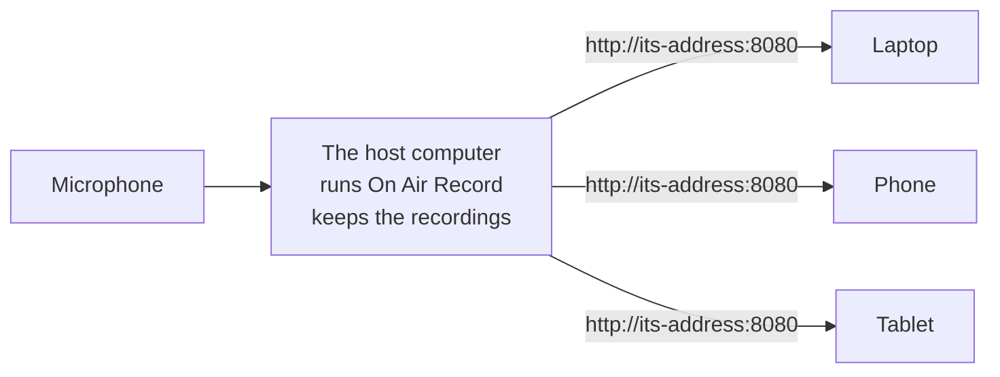
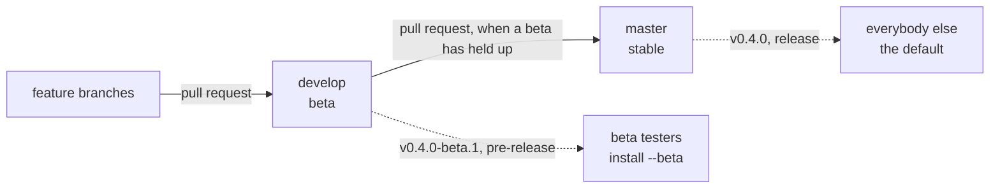

<!--
  This file is published to the GitHub wiki by .github/workflows/wiki.yml on every push to master, which
  rewrites the links between documents on the way. Images are linked by absolute raw.githubusercontent URL
  rather than by relative path, because the wiki is a separate repository and cannot see docs/images.
-->

# Installation and setup

This page is for whoever puts On Air Record on a machine and gets it running. Once it is running, the
[user guide](USER_GUIDE.md) covers how to actually use it.

You install it on **one** computer, the one with the microphone. Everybody else just opens a web address.
Nothing has to be installed on the listening devices.


```mermaid
flowchart LR
    mic["Microphone"] --> host["The host computer<br/>runs On Air Record<br/>keeps the recordings"]
    host -- "http://its-address:8080" --> laptop["Laptop"]
    host -- "http://its-address:8080" --> phone["Phone"]
    host -- "http://its-address:8080" --> tablet["Tablet"]
```

## Contents

- [What you need](#what-you-need)
- [The quick way](#the-quick-way)
- [Linux: microphone access](#linux-microphone-access)
- [Docker on Linux](#docker-on-linux)
- [Stopping it](#stopping-it)
- [Step 1: download](#step-1-download)
- [Step 2: run it](#step-2-run-it)
- [Step 3: open it](#step-3-open-it)
- [Logins and accounts](#logins-and-accounts)
- [Choosing a port](#choosing-a-port)
- [All the settings you can pass at start up](#all-the-settings-you-can-pass-at-start-up)
- [Where the recordings are written](#where-the-recordings-are-written)
- [Keeping it running: macOS](#keeping-it-running-macos)
- [Keeping it running: Linux](#keeping-it-running-linux)
- [Keeping it running: Windows](#keeping-it-running-windows)
- [Letting other machines reach it](#letting-other-machines-reach-it)
- [Upgrading](#upgrading)
- [Trying a beta](#trying-a-beta)
- [Uninstalling](#uninstalling)
- [Building from source](#building-from-source)
- [Publishing a release](#publishing-a-release)
- [Setup problems](#setup-problems)
- [Reporting a problem](#reporting-a-problem)
- [Credits](#credits)

## What you need

- A computer that stays switched on: macOS, Linux, or Windows. It does not need to be powerful.
- A microphone it can hear. Built in is fine.
- Disk space. Roughly **330 MB per hour** at full quality, or **110 MB per hour** at voice quality. How
  much you need in total depends on how far back you want to be able to listen, and the app works that
  figure out for you on its settings page.
- A network the listeners are also on.

Nothing else. There is no database to install, no runtime, no web server. The whole thing is one file.

## The quick way

One command does all three steps below. Run it from whatever folder you want the installation to live in.

**macOS and Linux**, in a terminal:

```sh
curl -fsSL https://raw.githubusercontent.com/shibbirweb/on-air-record/master/scripts/install.sh | sh
```

**Windows**, in PowerShell:

```powershell
irm https://raw.githubusercontent.com/shibbirweb/on-air-record/master/scripts/install.ps1 | iex
```

It works out which build your machine needs, downloads the latest release, checks it against the published
checksum, asks which port to use, and starts the service. Everything lands in one `on-air-record` folder
created right there:

```
on-air-record/
  on-air-record     the program
  start.sh          starts it again with your settings   (start.cmd on Windows)
  config            your settings
  data/             recordings and the database
```

Nothing is written anywhere else on the machine. To start it again later:

```sh
./on-air-record/start.sh          # macOS and Linux
```

```powershell
.\on-air-record\start.cmd         # Windows, or just double click it in Explorer
```

That reads `config`, so the port is only chosen once. Useful options:

| macOS and Linux | Windows | What it does |
| --- | --- | --- |
| `--port 9000` | `-Port 9000` | Use this port without asking |
| `--release v0.1.0` | `-Release v0.1.0` | Install that exact version instead of the newest |
| `--reconfigure` | `-Reconfigure` | Ask for the port again |
| `--update` | `-Update` | Fetch a newer release over the top |
| `--beta` | `-Beta` | Follow beta releases, see [Trying a beta](#trying-a-beta) |
| `--stable` | `-Stable` | Go back to stable releases |
| `--no-start` | `-NoStart` | Install and configure, but do not start |
| `--dir <path>` | `-Dir <path>` | Install somewhere other than the current folder |

On macOS and Linux, pass them after `--`:

```sh
curl -fsSL https://raw.githubusercontent.com/shibbirweb/on-air-record/master/scripts/install.sh | sh -s -- --port 9000
```

On Windows, `iex` cannot take parameters, so use the script block form:

```powershell
& ([scriptblock]::Create((irm https://raw.githubusercontent.com/shibbirweb/on-air-record/master/scripts/install.ps1))) -Port 9000
```

This also sidesteps the "unidentified developer" warning on macOS and SmartScreen on Windows, because a
file fetched with `curl` or `irm` is not quarantined the way a browser download is. Windows will still ask
about the firewall the first time the service starts; say yes for private networks.

It will refuse to run on ARM Linux, such as a Raspberry Pi, because there is no prebuilt binary for it.
That needs [building from source](#building-from-source).

The rest of this section is the same thing done by hand.

**On Linux, read [Linux: microphone access](#linux-microphone-access) first.** On a server, or any machine
you reach over SSH, your account usually cannot open the microphone until you add it to one group, and the
tempting shortcut of running it with `sudo` causes a second, quieter problem.

## Linux: microphone access

Linux keeps the sound hardware behind device files in `/dev/snd`, and only `root` and members of the
`audio` group may open them. When you sit at a desktop and log in there, you are given access
automatically. When you log in over SSH, which is how most servers are run, you are not.

### How you can tell

The web interface loads, but recording will not start. The recorder panel shows an error, and the log says
something like:

```
auto start failed ... device 'default' has no usable input config: ... 'snd_pcm_open' failed with error 'Permission denied (13)'
```

The giveaway is that **it works when started with `sudo`**. To confirm, as your normal user:

```sh
id -nG          # the groups you are in right now; is audio one of them?
arecord -l      # does this list your microphone?
sudo arecord -l # and does this?
```

If `arecord -l` lists nothing but `sudo arecord -l` shows your microphone, this is the problem. If neither
lists it, Linux cannot see the microphone at all: check the cable, try another USB port, and look at
`dmesg` for a driver message. That is outside the app.

### Fixing it

Add your account to the `audio` group, once:

```sh
sudo usermod -aG audio "$USER"
```

Then **log out and back in**. Over SSH, that means disconnecting and connecting again. A new group only
applies to logins that start after it was added, so until then nothing changes. Check that it took:

```sh
id -nG          # audio should now be in the list
arecord -l      # and your microphone should be listed without sudo
```

Now start it the normal way, without `sudo`:

```sh
./on-air-record/start.sh
```

### Do not run it with sudo

It works, which is exactly why it is tempting. The trouble comes later. Everything the program creates while
it runs as `root`, such as the day folders under `data/recordings`, belongs to `root`. The next time you
start it as yourself, even with the group fixed, it can open the microphone but cannot write into those
folders. The recorder panel still says **Recording**, and the live audio still plays, but **nothing is
saved** and the timeline stays empty. The only sign is in the log:

```
could not open a segment file error=io error: Permission denied (os error 13)
```

### If you already ran it with sudo

Stop the copy that runs as `root`, give the folder back to your account, and start it again as yourself:

```sh
sudo ./on-air-record/stop.sh               # needs sudo, because the running copy belongs to root
sudo chown -R "$USER": ./on-air-record     # take back everything it created
./on-air-record/start.sh                   # no sudo from now on
```

Without `sudo`, the stop script is not allowed to stop a process owned by `root`, so it waits and then
suggests `kill -9`. Do not use that; run it again with `sudo` instead.

Then check that recording really works. Leave it running for a minute and look at the timeline, not just
the recorder panel. New audio appears once each block of recording (10 seconds by default) is finished and
written, so an empty timeline after a minute means something is still wrong.

### Running it as a different account

You may not want it under your own login at all: a shared server, an admin account you would rather keep
separate, or simply wanting the recordings to belong to something other than you. Give it an account of its
own. It needs three things: to be in the `audio` group, to own the folder it is installed in, and to be the
account that starts it. It never needs `root`.

The examples call the account `onair`; any name works.

**1. Create the account and let it use the microphone.**

```sh
sudo useradd --create-home --shell /bin/bash onair
sudo usermod -aG audio onair
```

**2. Install it as that account**, so the account owns everything from the start. This puts it in the
account's home folder, `/home/onair/on-air-record`:

```sh
sudo -u onair -H sh -c 'cd ~ && curl -fsSL https://raw.githubusercontent.com/shibbirweb/on-air-record/master/scripts/install.sh | sh -s -- --port 8080 --no-start'
```

If you would rather keep it outside a home folder, such as in `/opt`, move it there afterwards. Moving
keeps the owner, so nothing else is needed:

```sh
sudo mv /home/onair/on-air-record /opt/on-air-record
```

If you already have an installation under your own account, hand that over instead of installing again.
Stop it first:

```sh
./on-air-record/stop.sh
sudo mv ./on-air-record /opt/on-air-record
sudo chown -R onair: /opt/on-air-record
```

**3. Start and stop it as that account**, always through `sudo -u`, using wherever it now lives:

```sh
sudo -u onair /home/onair/on-air-record/start.sh    # or /opt/on-air-record/start.sh
sudo -u onair /home/onair/on-air-record/stop.sh
```

This is not the same as `sudo ./on-air-record/start.sh`: `sudo -u onair` runs it as `onair`, not as
`root`, so every file it creates belongs to `onair` and the ownership trap above cannot happen. It also
picks up the `audio` group straight away, with no logging out, because `sudo` starts the program with the
account's current groups. Plain `sudo`, without `-u`, is still the thing to avoid.

Check it worked the same way as before: leave it running for a minute and look at the timeline.

Starting it this way ties it to your terminal, like any other manual start. To have it run in the
background and come back after a reboot, use the systemd unit below. It already follows this pattern, with
an account of its own called `on-air-record`.

### When it runs as a system service

The systemd unit in [Keeping it running: Linux](#keeping-it-running-linux) runs as its own
`on-air-record` account and already joins the `audio` group, so none of the above applies to it. The same
ownership trap does apply if you ever start the program by hand with `sudo` against the service's data
directory. Put it right with:

```sh
sudo systemctl stop on-air-record
sudo chown -R on-air-record: /var/lib/on-air-record
sudo systemctl start on-air-record
```

## Docker on Linux

Every release is also published as a container image, `ghcr.io/shibbirweb/on-air-record`, for 64 bit
Intel and AMD machines and for 64 bit ARM, which includes a Raspberry Pi running a 64 bit OS. It is the
same program as the downloads, with nothing added.

The same image, with the same tags, is on Docker Hub as `shibbirweb/on-air-record`. Either works wherever
an image is named below. This page uses `ghcr.io` because Docker Hub limits how often one address may
download without signing in, which a shared network can run into.

**This only works on a Linux host.** The container reaches the microphone through the host's sound device
files in `/dev/snd`. Docker Desktop on macOS and Windows runs containers inside a small virtual machine that
has no sound hardware, so there is nothing to pass through and the app would list no microphones. On a Mac
or a Windows PC, use [the quick way](#the-quick-way) instead.

Nearly every problem with this setup is a permission problem, and each one looks the same from the web
page: no microphones listed. The next part explains the three things that have to be right, so that the
steps after it make sense and the table at the end can tell which one is wrong.

### How the container gets the microphone

Linux keeps each sound card behind files in `/dev/snd`. They belong to `root` and to one group, usually
called `audio`, and only that group may open them:

```
$ ls -ln /dev/snd
crw-rw---- 1 0 29 116,  7 Sep 27 09:12 controlC1
crw-rw---- 1 0 29 116,  6 Sep 27 09:12 pcmC1D0c
crw-rw---- 1 0 29 116, 33 Sep 27 09:12 timer
```

The `29` is the group's number. The program in the container can only record when all three of these hold:

| | What it needs | Given by | If it is missing |
| --- | --- | --- | --- |
| 1 | The device files exist inside the container | `devices: /dev/snd` | `/dev/snd` does not exist in the container |
| 2 | The container is allowed to use devices at all | `devices:`, and only `devices:` | The files are there, but opening them says `Operation not permitted` |
| 3 | The program is in the group that owns the files | `group_add:` with that group's **number** | The files are there, but opening them says `Permission denied` |

Three things follow from that:

- **The group has to be given by number, not by name.** The container has its own list of group names,
  and its `audio` is 29. The host's `audio` is 29 on Debian, Ubuntu and Raspberry Pi OS, but 63 on Fedora
  and something else again on Arch. `group_add: audio` would quietly give the container the wrong one. The
  steps below read the number from the device files themselves, which is right by definition.
- **Your own account does not need to be in the `audio` group,** unlike running the program directly. Docker
  opens nothing as you; the program inside runs as its own user, number 10001, and is given the group. You
  only need to be allowed to run `docker`, either through the `docker` group or with `sudo`. Using `sudo`
  here does not cause [the ownership problem it causes for a direct install](#do-not-run-it-with-sudo),
  because the files it creates belong to the container's user either way.
- **`/dev/snd` must be passed as a device, not as a volume.** `-v /dev/snd:/dev/snd` makes the files
  appear, which looks right, but Docker only permits a container to open devices it was given with
  `--device` or `devices:`.

### Before you start: check the host

These need no special permissions, so they give a straight answer whichever account you use:

```sh
uname -s                          # must say Linux
docker compose version            # Docker with the Compose plugin
cat /proc/asound/cards            # the sound cards Linux has found
ls -d /proc/asound/card*/pcm*c    # the ones that can record: one line per microphone input
stat -c '%g' /dev/snd/* | sort -u # the group number that owns them: expect exactly one number
```

- **`/proc/asound/cards` is empty, or no `pcm...c` lines,** means Linux itself has not found a microphone.
  Nothing in Docker can fix that: check the cable, try another USB port, and look at `dmesg` for a driver
  message.
- **The last command prints two numbers,** which is unusual. Note both; the compose file can be given more
  than one, see [the table below](#permission-problems-what-you-see-and-what-fixes-it).

`arecord -l` is the usual way to list microphones, but it runs as you, and when your account is not in the
`audio` group it lists nothing even though the card is there. That is fine for Docker, for the reason
above; `/proc/asound/cards` is the check that is not misled by it.

### With Docker Compose

In an empty folder:

```sh
curl -fsSLO https://raw.githubusercontent.com/shibbirweb/on-air-record/master/packaging/compose.yaml

# The group number that owns the sound devices, and your time zone
audio_gid="$(stat -c %g /dev/snd/timer)"
zone="$(timedatectl show -p Timezone --value 2>/dev/null || readlink -f /etc/localtime | sed 's|.*/zoneinfo/||')"
printf 'AUDIO_GID=%s\nTZ=%s\n' "$audio_gid" "$zone" > .env
cat .env

docker compose up -d
```

`cat .env` should show a number and a place, such as `AUDIO_GID=29` and `TZ=Europe/London`. If
`AUDIO_GID` is empty, `/dev/snd` does not exist on this machine: go back to the checks above.

That `.env` file sits beside `compose.yaml` and every `docker compose` command reads it, so this is done
once. It holds the two things the container cannot work out for itself:

- **`AUDIO_GID`** is the number from [the table above](#how-the-container-gets-the-microphone), handed to
  the container with `group_add`.
- **`TZ`, your time zone.** Recordings are filed by calendar day, and a container otherwise thinks it is in
  UTC, so a recording made at 1 a.m. in Dhaka would land on the previous day.

Add `OAR_PORT=9000` to `.env` to serve on another port. The service inside still listens on 8080; only the
host's side changes.

The container never runs as `root`. It restarts with the host unless you stop it, and its recordings,
settings and accounts live in a volume called `on-air-record_data`, which survives removing and recreating
the container.

### Check that it can hear

Before opening the page, confirm all three requirements from inside the running container:

```sh
docker exec on-air-record ls -ln /dev/snd     # 1: the device files, with the group number from .env
docker exec on-air-record id                  # 3: that number must be in the groups list
curl -s http://localhost:8080/api/devices     # the microphones the service can actually open
```

The last one answers until logins are set up, so run it first, on the host, with your port if you changed
it. An empty list, `{"devices":[]}`, with the
first two looking right means something is holding the microphone or it is not a recording device; see
the table below. A list with names in it means it works: open `http://<this machine's address>:8080`,
answer the question about logins, and pick the microphone on the settings page.

Then let it run for a minute and check the timeline shows audio, not just that the recorder panel says
**Recording**. New audio appears once each block of recording, 10 seconds by default, is written.

### Without Compose

The same thing as one command, with the same three requirements: `--device` for the first two, and
`--group-add` with the number for the third:

```sh
docker run -d --name on-air-record --restart unless-stopped \
  -p 8080:8080 \
  --device /dev/snd \
  --group-add "$(stat -c %g /dev/snd/timer)" \
  -e TZ="$(timedatectl show -p Timezone --value 2>/dev/null || readlink -f /etc/localtime | sed 's|.*/zoneinfo/||')" \
  -v on-air-record_data:/data \
  --stop-timeout 30 \
  ghcr.io/shibbirweb/on-air-record:latest
```

`--stop-timeout 30` gives it time to close and index the recording it is writing when it is stopped.
Docker's default of ten seconds can cut that short and lose the last few seconds.

### Permission problems: what you see and what fixes it

**The service diagnoses most of these itself.** In a container it looks at its own `/dev/snd` and says
which requirement is missing and what to change, using the group number it found:

```
auto start failed, the service is running without capture error=audio device error: device 'default' has
no usable input config: ... The container is not in the group that owns /dev/snd (group 63). Set
AUDIO_GID=63 in .env and run docker compose up -d, or with docker run add --group-add 63.
```

That text appears in `docker compose logs` when recording starts automatically, and in the recorder panel
when **Start** is pressed. With automatic start switched off it is logged once when the container starts.
The table covers the same cases, and the ones it cannot see from inside, such as a muted input. Find the
row that matches, then use the fix beside it.
After changing `compose.yaml` or `.env`, run `docker compose up -d`, which recreates the container;
`docker compose restart` does not pick up changes to either.

| What you see | Why | Fix |
| --- | --- | --- |
| No microphones, and `docker exec on-air-record ls /dev/snd` says there is no such directory | The devices were not passed in | Check the `devices:` lines in `compose.yaml`, or add `--device /dev/snd` |
| No microphones, the files are there, and the log says `Operation not permitted` | `/dev/snd` was mounted as a volume, not passed as a device | Remove any `/dev/snd` line under `volumes:` and use `devices:` |
| No microphones, the files are there, and the log says `Permission denied` | The container is not in the group that owns them | Compare `ls -ln /dev/snd` on the host with `docker exec on-air-record id`, put the right number in `AUDIO_GID`, `docker compose up -d` |
| A microphone plugged in after the container started is missing | The device files are copied in when the container starts | `docker compose restart` |
| The microphone is listed, but starting says `Device or resource busy` | Another program is recording from it; most sound cards allow one at a time | Stop the other program. On a desktop, PipeWire or PulseAudio may hold it while any app records |
| It records, but the timeline shows a flat line | The capture input is muted or turned down in the host's mixer, not a permission problem | On the host, install `alsa-utils` if needed, then `alsamixer -c <card number>` (the number from `/proc/asound/cards`): F4 for the capture controls, Space to switch capture on, arrow keys to raise it. `sudo alsactl store` keeps it after a reboot |
| The container stops as soon as it starts, over and over, with `could not start the service error=io error: Permission denied` | It cannot write its data folder | See [the data folder](#the-data-folder-and-permissions) below |
| `stat` printed two group numbers | The device files do not all share one group | List both under `group_add:` in `compose.yaml`, one per line |

#### SELinux, on Fedora, RHEL and similar

With SELinux enforcing, a folder mounted from the host needs relabelling before a container may write to
it: add `:Z` to the volume, as in `- /srv/on-air-record:/data:Z`. Only do that for a folder used by this
container alone; `:Z` on a home folder or a system folder breaks other programs' access to it.

If the group numbers match and the log still says `Permission denied` on the sound devices, check for a
denial with `sudo ausearch -m avc -ts recent`. If it names the sound devices, adding
`security_opt: ["label:disable"]` to the service lifts SELinux for this container. That has not been tried
on a real SELinux host here, so treat it as a lead rather than a known fix.

#### Rootless Docker and Podman

Rootless Docker and rootless Podman give containers their own range of user and group numbers, so the
host's audio group number usually means nothing inside, and `group_add` with it does not reach the devices.
Rootless Podman can pass your own groups through instead with `--group-add keep-groups`, which needs your
account in the host's `audio` group. Neither has been tried here; ordinary Docker, run by the system
service, is the tested way.

#### Shortcuts not to take

Each of these makes the microphone appear, which is why they get suggested. Each has a cost the proper fix
does not:

- **`privileged: true` or `--privileged`** gives the container every device on the machine, including the
  disks, and turns off most of what keeps it contained. The three requirements above are the whole of what
  it needs.
- **`user: root`**, or `--user 0`, runs the service as root, which also makes everything it writes belong
  to root. Being root skips requirement 3, but `group_add` already covers it.
- **`chmod 666 /dev/snd/*`** on the host lets every program and every account on the machine open the
  microphone, and is undone at the next reboot or replug anyway, so it breaks again later.
- **`group_add: audio`**, by name, picks the container's idea of the audio group, which is right on some
  distributions and silently wrong on others.

### The data folder and permissions

The service runs as user number 10001 and must be able to write its data folder. The named volume in
`compose.yaml` is set up that way from the start, so it needs nothing. A folder of your own, such as one on
a larger disk, has to be given to that user before the container starts:

```yaml
    volumes:
      - /srv/on-air-record:/data
```

```sh
sudo mkdir -p /srv/on-air-record
sudo chown -R 10001:10001 /srv/on-air-record
```

Without the `chown`, the container stops as soon as it starts, over and over, and `docker compose logs`
shows `could not start the service error=io error: Permission denied`. Three kinds of disk need something
different:

- **A USB drive formatted as exFAT or NTFS** has no owners to change, so `chown` fails with `Operation not
  permitted`. Mount it with the owner set instead, by adding `uid=10001,gid=10001` to its mount options in
  `/etc/fstab`, or reformat it as ext4.
- **A network share over NFS** usually refuses `chown` from the client. Change the owner on the server
  that exports it.
- **With SELinux,** add `:Z` as [described above](#selinux-on-fedora-rhel-and-similar).

**Running as your own user instead.** Rather than giving the folder to 10001, the container can run as
you, with `user: "1000:1000"` under the service in `compose.yaml` (`id -u` and `id -g` give your numbers).
Everything it writes then belongs to you. That replaces the image's own user, and with it the image's own
audio group, so `group_add` stays exactly as it is and is now the only way the container reaches the
microphone.

A recordings folder chosen on the settings page follows the same rules: it has to be inside `/data`, or
inside another folder mounted into the container the same way and owned by the user it runs as, or it is
lost when the container is recreated.

### Day to day

Run these in the folder with `compose.yaml`:

```sh
docker compose logs -f         # watch the log
docker compose ps              # is it running, and is it healthy
docker compose stop            # stop it; it closes and indexes the recording in progress
docker compose start           # start it again
```

**Health.** The image checks itself every 30 seconds by asking the service's `/api/health`, so
`docker compose ps` and `docker ps` show it as `healthy`, or `unhealthy` after three failed checks in a
row. Healthy means the service is up and answering, not that it is recording: one still waiting for you
to pick a microphone is healthy. To see the recent checks, or to run one yourself:

```sh
docker inspect --format '{{json .State.Health}}' on-air-record
docker exec on-air-record on-air-record health
```

Docker on its own only reports an unhealthy container; `restart: unless-stopped` restarts it when the
program exits, not when a check fails. Monitoring tools and orchestrators that act on health read the same
status.

**Updating.** Admins are shown these same steps in the app when a new version is out:

```sh
docker compose pull
docker compose up -d
```

`latest` always points at the newest stable release. To stay on one version, change the `image` line to
name it, such as `ghcr.io/shibbirweb/on-air-record:0.7.0`, and change it again when you want to move.

**Betas.** Change the `image` line to end in `:beta`, and uncomment `OAR_CHANNEL: beta` below it so the
update notices follow betas too. `beta` always points at the newest release of any kind, the same as the
installer's `--beta`, so you get the stable release too once a beta becomes one.

**A forgotten admin password,** or a lost phone, is reset through the program inside the container:

```sh
docker exec on-air-record on-air-record auth reset-password you@example.com
docker exec on-air-record on-air-record auth reset-2fa you@example.com
```

**Uninstalling:** `docker compose down` removes the container. The recordings stay in the volume until you
also run `docker volume rm on-air-record_data`, which **deletes them all**.

## Stopping it

While the terminal that started it is still open, **Ctrl+C** stops it cleanly.

Once that terminal is gone, or if you started it and closed the window without the service noticing, use
the stop script that sits beside the program:

```sh
./on-air-record/stop.sh            # macOS and Linux
```

```powershell
.\on-air-record\stop.cmd           # Windows, or double click it in Explorer
```

It only stops the service started from **that folder**, so a second copy installed somewhere else keeps
running. It reports what it stopped, or says nothing was running, which is not an error.

### If you have lost the folder

Find it by the port it is serving on:

```sh
# Linux
sudo ss -lptn 'sport = :8080'

# macOS
sudo lsof -i :8080

# then, with the process id from that
kill <pid>
```

```powershell
# Windows
Get-Process on-air-record | Format-Table Id, Path
Stop-Process -Name on-air-record
```

**Use a plain `kill`, not `kill -9`.** The service closes and indexes the segment it is part way through
writing when it is asked to stop politely, so the last few seconds stay playable. `kill -9` throws them
away. Only force it if a plain `kill` has had twenty seconds and done nothing.

Windows has no polite equivalent for a console program, so `stop.cmd` is a hard stop there and does lose
the few seconds not yet written out. Ctrl+C in the window keeps them.

### Stopping recording is not the same as stopping the service

The **Stop** button in the Recorder panel of the web interface stops *recording*. The service keeps
running and keeps serving the page, so you can still listen back to everything already recorded. That
button is for pausing the recorder, not for shutting the machine down.

## Step 1: download

Go to the **Releases** page of the repository and download the file for your machine.

| Your machine | File to download |
| --- | --- |
| Mac with Apple silicon (M1 and later) | `on-air-record-<version>-aarch64-apple-darwin.tar.gz` |
| Mac with an Intel processor | `on-air-record-<version>-x86_64-apple-darwin.tar.gz` |
| Linux, 64 bit Intel or AMD | `on-air-record-<version>-x86_64-unknown-linux-gnu.tar.gz` |
| Windows, 64 bit | `on-air-record-<version>-x86_64-pc-windows-msvc.zip` |

Not sure which Mac you have? Apple menu, About This Mac. Anything that says Apple M1, M2, M3 or later needs
the `aarch64` file.

There is no prebuilt file for ARM Linux, such as a Raspberry Pi. That works, but you have to
[build it from source](#building-from-source).

Each download has a `.sha256` file next to it if you want to check it arrived intact:

```sh
# macOS and Linux
shasum -a 256 -c on-air-record-<version>-<target>.tar.gz.sha256
```

```powershell
# Windows
Get-FileHash on-air-record-<version>-x86_64-pc-windows-msvc.zip -Algorithm SHA256
```

## Step 2: run it

The web interface is built into the program, so there is nothing to unpack beyond the archive itself and
nothing to point it at.

### macOS

```sh
tar -xzf on-air-record-<version>-aarch64-apple-darwin.tar.gz
cd on-air-record-<version>-aarch64-apple-darwin
./on-air-record
```

Two things happen on a Mac the first time, both of them normal:

1. **macOS blocks the download.** It was not downloaded from the App Store and is not signed, so you get
   a warning. Open System Settings, Privacy and Security, scroll to the bottom, and press **Open Anyway**
   next to the message about `on-air-record`. Then run it again.
2. **macOS asks for the microphone.** Allow it. If you miss the prompt or refuse it, the app runs but sees
   no microphones at all, which looks like broken hardware. Fix it under System Settings, Privacy and
   Security, Microphone, then start the app again.

Run it once by hand like this before setting it up to start automatically, because a background service
never gets shown that microphone prompt.

### Linux

ALSA is how Linux hands out audio, and the program loads its shared library at run time. Desktop systems
already have it. A minimal server may not, in which case the program fails to start with a message about
`libasound.so.2`. Install it with whichever name your distribution uses:

```sh
sudo apt install libasound2t64 || sudo apt install libasound2   # Debian, Ubuntu, Raspberry Pi OS
sudo dnf install alsa-lib                                        # Fedora, RHEL
```

Then:

```sh
tar -xzf on-air-record-<version>-x86_64-unknown-linux-gnu.tar.gz
cd on-air-record-<version>-x86_64-unknown-linux-gnu
./on-air-record
```

Check the machine can actually see a microphone with `arecord -l`. If that lists nothing, the app will list
nothing either, and the problem is the operating system rather than the app.

Your user account has to be in the `audio` group to reach the sound hardware. Desktop accounts usually are
already; accounts you reach over SSH usually are not. [Linux: microphone access](#linux-microphone-access)
covers how to check, how to fix it, and why running it with `sudo` instead makes things worse.

### Windows

Unzip the file, open the folder, and double click `on-air-record.exe`. A console window opens and stays
open. That window **is** the service: closing it stops the recording.

Two things to expect:

1. **SmartScreen warns you.** Press More info, then Run anyway.
2. **Windows Firewall asks whether to allow it.** Say yes for private networks, or nothing else on your
   network will be able to connect. If you dismissed that prompt, see
   [Letting other machines reach it](#letting-other-machines-reach-it).

Windows is built and tested automatically on every change, but nobody has yet sat at a Windows desktop and
listened to it end to end. It should work; you may be the first to find out.

## Step 3: open it

Whatever the platform, the program prints the address it is listening on when it starts:

```
INFO on_air_record: control room ready on http://0.0.0.0:8080
```

`0.0.0.0` means "every network connection this machine has", not a literal address you can type. On the
machine itself, open:

```
http://localhost:8080
```

You should see this:


From another device on the same network, use the host machine's address on the network:

```sh
# macOS: find the address of whichever interface is actually in use
ipconfig getifaddr "$(route -n get default | awk '/interface:/{print $2}')"

# Linux
hostname -I

# Windows: look for IPv4 Address under your active adapter
ipconfig
```

Then open `http://<that-address>:8080` from the phone, tablet or laptop. Give that address to anyone who
needs to listen.

**The first time anyone opens the page, it asks whether to protect the recorder with a login.** Be the
first to open it, so that you are the one who answers. [Logins and accounts](#logins-and-accounts) explains
the choice.

## Logins and accounts

A recorder is a microphone that is always on, so decide who can reach it. The first person to open the page
is asked once:


- **Set up accounts.** They create the admin account on the spot, and from then on everybody signs in.
- **Keep it open.** No login, as in earlier versions. Anyone who can reach the page can listen, go back
  through the recordings, download them, and change the settings.

Keeping it open is reasonable on a network where you trust every person and every device. On a shared
network, an office, or anywhere reachable from outside, set up accounts. Either way, pages served by other
websites are refused, so opening some other site cannot make a browser listen in or press buttons here.

The question is asked by whoever arrives first. On a network with other people on it, open the page
yourself as soon as it starts, so that nobody answers it before you do. An existing installation that is
upgraded asks the question too, on its next visit.

The [user guide](USER_GUIDE.md#signing-in) walks through every screen of this with pictures: the first
visit, signing in, account settings, two factor sign in, and managing accounts.

### Who can do what

| | Admin | Listener |
| --- | --- | --- |
| Listen live, scrub back, change day, play faster or slower | Yes | Yes |
| Export audio as WAV | Yes | Yes |
| See bookmarks and jump to them | Yes | Yes |
| Start and stop recording, choose the microphone | Yes | No |
| Add and remove bookmarks | Yes | No |
| Settings, including retention and where recordings go | Yes | No |
| Add, change and remove accounts | Yes | No |

Admins add accounts under **Settings, Access**, and give each person their email and a first password;
there is no mail server, so nobody is emailed anything. Everyone can change their own password under
**Account settings**, in the account menu at the top right. There is always at least one admin: the last
one cannot be removed or made a listener.

### Switching accounts on later

If you kept it open and change your mind, go to **Settings, Access, Set up accounts**. Anyone already
listening is asked to sign in within a few seconds.

### Two factor sign in

Anyone with an account, admin or listener, can add a second step to signing in: a 6 digit code from an
authenticator app on their phone, such as Google Authenticator, Microsoft Authenticator, Authy or
1Password. Someone who learns the password still cannot sign in without the phone. It is recommended for
admins, whose accounts can change everything.

Each person switches it on for themselves, under **Account settings** in the account menu at the top right:
scan the QR code with the app, type the code it then shows, and save the ten **recovery codes** it hands
out. Each recovery code signs in once in place of a code from the phone. They are shown only at that
moment, so download or copy them and keep them away from the phone. On a plain `http://` address the
browser does not allow copying, so use **Download**.

Codes change every 30 seconds and depend on the clock, so the host and the phone need roughly the right
time. About 30 seconds either way is forgiven. If codes are refused that the phone is showing, check the
host's clock first; `timedatectl` on Linux shows whether it is kept in sync.

**Admins can see who has it**, as a **2FA** badge next to each account under **Settings, Access**.

### A lost phone

- **With a recovery code:** sign in with it in place of the code. Then set up the new phone under **Account
  settings**, **Two factor sign in**: turn it off with your password and set it up again. **New recovery
  codes** there replaces a set that is running low.
- **Without recovery codes, when an admin can help:** the admin presses the shield button next to the
  account under **Settings, Access**. The person then signs in with their password alone.
- **The only admin, without recovery codes:** remove it on the host, like a password reset:

  ```sh
  ./on-air-record/on-air-record --data-dir ./on-air-record/data auth reset-2fa you@example.com
  ```

### Forgotten passwords

- **A listener, or an admin when another admin can help:** an admin opens **Settings, Access**, and sets a
  new password with the key button next to the account.
- **The only admin:** reset it on the host, with the program itself, against the same data folder. It
  prints a new password and works whether or not the service is running:

  ```sh
  ./on-air-record/on-air-record --data-dir ./on-air-record/data auth reset-password you@example.com
  ```

  For the systemd service, run it as the service account, so the database keeps its owner:
  `sudo -u on-air-record on-air-record --data-dir /var/lib/on-air-record auth reset-password you@example.com`.

- **Turn logins off completely**, deleting every account, with `auth disable` in place of
  `auth reset-password you@example.com`. The page then works without a login, and accounts can be set up
  again from the settings.

After five wrong passwords or codes from one device, that device has to wait 15 minutes. Restarting the
service clears the wait, which is worth knowing if it was you.

### Behind a reverse proxy with HTTPS

Logins work over plain HTTP on your network. If you put the recorder behind a reverse proxy that serves it
over HTTPS, have the proxy send `X-Forwarded-Proto: https` and pass the original `Host` header through
unchanged. The first marks the login cookie secure. The second matters because the recorder refuses
changes from any page whose address does not match the one it was reached on, and a proxy that rewrites
`Host` makes every request look like it came from somewhere else.

## Choosing a port

8080 is only the default. Change it with `--port` on the command line:

```sh
# macOS and Linux
./on-air-record --port 9000
```

```powershell
# Windows
.\on-air-record.exe --port 9000
```

or with the `OAR_PORT` environment variable, which is the easier one to use with a service manager that
does not let you edit the command line:

```sh
# macOS and Linux
OAR_PORT=9000 ./on-air-record
```

```powershell
# Windows, for this console window only
$env:OAR_PORT = "9000"
.\on-air-record.exe
```

**If you set both, the command line wins.** That is deliberate, so you can override a service's configured
port for one run without editing the service.

Reasons to change it:

- **Something else already uses 8080.** It is a popular port. If it is taken, the app refuses to start and
  says so rather than failing quietly:
  ```
  ERROR on_air_record: could not bind the http listener error=Address already in use (os error 48) address=0.0.0.0:8080
  ```
  Pick another number and try again.
- **You want a memorable number** to give people, such as 8000 or 9000.
- **You want to run two copies**, for example a test one alongside the real one. Give each its own port
  **and its own data directory**, or they will fight over the same database.

Pick a number between 1024 and 65535. Below 1024 needs administrator rights on macOS and Linux and is not
worth the trouble.

Whatever you choose, the address becomes `http://<host>:<your port>`, and it has to be included: browsers
assume port 80 when you leave it out.

## All the settings you can pass at start up

Every option can be given as a command line flag or as an environment variable. The flag wins if you use
both. Run `on-air-record --help` to see this list on the machine itself.

| Flag | Environment variable | Default | What it does |
| --- | --- | --- | --- |
| `--port` | `OAR_PORT` | `8080` | The port the web interface is served on. |
| `--host` | `OAR_HOST` | `0.0.0.0` | Which network connections to accept. `0.0.0.0` means all of them. Use `127.0.0.1` to allow only the machine itself. |
| `--data-dir` | `OAR_DATA_DIR` | `./data` | Where recordings and the database are kept. |
| `--static-dir` | `OAR_STATIC_DIR` | `../frontend/dist` | A folder holding a web interface to serve instead of the built in one. You do not normally need this. |
| `--log-level` | `OAR_LOG_LEVEL` | `info` | How much detail is printed: `error`, `warn`, `info`, `debug` or `trace`. Use `debug` when reporting a problem. |

A complete example:

```sh
./on-air-record --port 9000 --data-dir /srv/on-air-record --log-level debug
```

The same thing with environment variables:

```sh
OAR_PORT=9000 OAR_DATA_DIR=/srv/on-air-record OAR_LOG_LEVEL=debug ./on-air-record
```

Everything else, such as which microphone to use, how long to keep recordings and at what quality, is
changed on the app's own settings page while it is running. It is remembered between restarts, so it does
not belong on the command line. The [user guide](USER_GUIDE.md#settings) covers those.

## Where the recordings are written

By default, in a folder called `data` **next to wherever you happened to run the program from**, not next
to the program itself. Start it from a different folder and it will look like it has lost all its
recordings, when in fact it has made a second empty `data` folder somewhere else.

Avoid that by always giving it a full path:

```sh
# macOS and Linux
./on-air-record --data-dir /srv/on-air-record

# Windows
.\on-air-record.exe --data-dir C:\on-air-record\data
```

That folder ends up holding:

```
<data-dir>/
  on-air-record.sqlite     the settings, and the index of what was recorded when
  recordings/              the audio itself, in a folder per day
```

Point it at a disk with room. If the disk fills up, recording stops. The app's settings page will estimate
how much you need for the history you want to keep, and it deletes its own old recordings to stay inside
that limit.

The recordings folder can be moved somewhere else later from the settings page without restarting, and
without losing what has already been recorded.

## Keeping it running: macOS

For a machine that is always on, run it with `launchd`.

Run it by hand once first and allow the microphone prompt, otherwise a background job will silently find
no microphones.

Create `~/Library/LaunchAgents/com.onairrecord.plist`:

```xml
<?xml version="1.0" encoding="UTF-8"?>
<!DOCTYPE plist PUBLIC "-//Apple//DTD PLIST 1.0//EN" "http://www.apple.com/DTDs/PropertyList-1.0.dtd">
<plist version="1.0">
<dict>
  <key>Label</key>
  <string>com.onairrecord</string>
  <key>ProgramArguments</key>
  <array>
    <string>/usr/local/bin/on-air-record</string>
    <string>--port</string>
    <string>8080</string>
    <string>--data-dir</string>
    <string>/Users/YOUR-NAME/on-air-record/data</string>
  </array>
  <key>RunAtLoad</key>
  <true/>
  <key>KeepAlive</key>
  <true/>
  <key>StandardErrorPath</key>
  <string>/tmp/on-air-record.log</string>
</dict>
</plist>
```

Then:

```sh
sudo cp on-air-record /usr/local/bin/
launchctl load ~/Library/LaunchAgents/com.onairrecord.plist
```

Use a **LaunchAgent** in your own home folder as shown, not a system wide LaunchDaemon. Microphone
permission on macOS belongs to a logged in user, and a daemon running as the system has no user to have
been granted it. The cost is that recording only runs while you are logged in.

## Keeping it running: Linux

The repository ships a systemd unit at
[`packaging/on-air-record.service`](../packaging/on-air-record.service), and it is included in the Linux
release archive. Its header comment carries the full install sequence. In short:

```sh
sudo install -m 755 on-air-record /usr/local/bin/on-air-record
sudo useradd --system --home /var/lib/on-air-record --shell /usr/sbin/nologin on-air-record
sudo usermod -aG audio on-air-record
sudo install -d -o on-air-record -g on-air-record /var/lib/on-air-record
sudo install -m 644 on-air-record.service /etc/systemd/system/
sudo systemctl daemon-reload
sudo systemctl enable --now on-air-record
```

**The `usermod -aG audio` line is the one people miss.** Without it the service starts, serves the web
interface, and lists no microphones at all, which looks like a hardware fault rather than a permissions
one. Do not work around it by starting the program by hand with `sudo`; see
[When it runs as a system service](#when-it-runs-as-a-system-service) for why, and how to recover.

To change the port or the data directory, edit the `Environment=` lines in the unit file:

```ini
Environment=OAR_DATA_DIR=/var/lib/on-air-record
Environment=OAR_HOST=0.0.0.0
Environment=OAR_PORT=8080
```

then reload and restart:

```sh
sudo systemctl daemon-reload
sudo systemctl restart on-air-record
```

Useful afterwards:

```sh
systemctl status on-air-record     # is it running
journalctl -u on-air-record -f     # watch the log
sudo systemctl stop on-air-record  # stop recording
```

## Keeping it running: Windows

There is no service wrapper built into the program, because an untested code path would be worse than a
documented command. Use one of the two standard tools.

**[NSSM](https://nssm.cc/) is the better option.** It supervises an ordinary console program properly,
restarts it if it stops, and captures its output to a log:

```powershell
nssm install OnAirRecord C:\on-air-record\on-air-record.exe
nssm set OnAirRecord AppParameters "--port 8080 --data-dir C:\on-air-record\data"
nssm set OnAirRecord AppStdout C:\on-air-record\service.log
nssm set OnAirRecord AppStderr C:\on-air-record\service.log
nssm start OnAirRecord
```

**The built in `sc.exe` also works**, with a caveat:

```powershell
sc.exe create OnAirRecord binPath= "C:\on-air-record\on-air-record.exe --port 8080 --data-dir C:\on-air-record\data" start= auto
sc.exe start OnAirRecord
```

Note the space after each `=`, which `sc.exe` insists on. It expects a program written to talk to the
Windows service manager, which this is not, so it will report a timeout on start even though the process
is running fine. That is why NSSM is the better choice.

Whichever you use: **the Windows audio session belongs to the signed in user.** A service running as
`LocalSystem` may see no capture devices at all. Set the service to run as the account whose microphone you
want to record, under Services, the service's Properties, Log On.

## Letting other machines reach it

If the app works on the host machine at `http://localhost:8080` but nothing else on the network can reach
it, the firewall is almost always the reason. The port has to be open for incoming connections.

```powershell
# Windows, as administrator, adjust the port to match yours
netsh advfirewall firewall add rule name="On Air Record" dir=in action=allow protocol=TCP localport=8080
```

```sh
# Linux with ufw
sudo ufw allow 8080/tcp

# Linux with firewalld
sudo firewall-cmd --permanent --add-port=8080/tcp && sudo firewall-cmd --reload
```

macOS does not usually block this, but if it does, System Settings, Network, Firewall, Options, and allow
incoming connections for `on-air-record`.

Also check that `--host` has not been set to `127.0.0.1`, which restricts it to the machine itself on
purpose.

**Do not forward this port through your router to the internet**, even with accounts switched on. Without
them, anyone who can reach the address can listen to the microphone and change the settings. With them, a
password is all that stands between the internet and the microphone, and the service has not been built or
tested to face the open internet. If you need access from elsewhere, use a VPN into that network.

## Upgrading

The control room tells admins when a new version is out, with what changed and the commands to update for
the way this copy was installed; see the user guide's Updates section. To do it by hand:

1. Stop the service.
2. Replace the program file with the new one.
3. Start it again.

For a folder made by the installer, those three steps are two commands, run as the account that owns the
folder:

```sh
./on-air-record/stop.sh
curl -fsSL https://raw.githubusercontent.com/shibbirweb/on-air-record/master/scripts/install.sh | sh -s -- --update
```

Stop it first: `--update` replaces the program and starts it again, and a copy still running would hold
the port.

Running it in Docker: `docker compose pull` then `docker compose up -d`, as in
[Docker on Linux](#day-to-day).

**The update check.** Every six hours, and a minute after it starts, the service asks
`api.github.com` for the list of releases. That is the only request it ever makes to the internet. It
sends nothing about the recorder beyond its version in the user agent, and it never downloads or installs
anything. Turn it off under Settings, Updates, **Check for updates automatically**. A machine with no
internet access needs no change: the check fails quietly and tries again later.

Leave the data directory alone. Recordings, settings and bookmarks all live there and carry over. The
database upgrades itself on first start if the new version needs it.

Upgrading from a version without logins: the next visit to the page asks whether to set up accounts. Open
it yourself straight after upgrading, so that you are the one who answers. See
[Logins and accounts](#logins-and-accounts).

Nothing else is written anywhere on the machine, so there is no cache or configuration file to clear.

## Trying a beta

New features are released as a **beta** first, with a version like `0.4.0-beta.1`, for people willing to
try them before everybody else gets them. Betas are tested on all three platforms like any release, but
they are new, so expect the occasional rough edge, and please
[report what you find](#reporting-a-problem).

Install or switch to betas with the installer's `--beta` option:

```sh
curl -fsSL https://raw.githubusercontent.com/shibbirweb/on-air-record/master/scripts/install.sh | sh -s -- --beta
```

```powershell
& ([scriptblock]::Create((irm https://raw.githubusercontent.com/shibbirweb/on-air-record/master/scripts/install.ps1))) -Beta
```

That installs the newest release of any kind, beta or stable, and the folder remembers the choice, so a
later `--update` fetches the newest beta without needing `--beta` again. When a beta becomes the stable
release, you get that too.

To go back to stable releases, run the installer with `--stable` (or `-Stable`). It does not step
backwards: if the beta you have is newer than the latest stable release, it keeps the beta, because an
older version may not understand the newer one's data, and switches over as soon as a newer stable
release is out. To pin one exact version instead, use `--release v0.4.0-beta.1`.

A beta's data carries over into the stable release it leads up to, so there is nothing to migrate by hand.

## Uninstalling

1. Stop the service, and remove it: `sudo systemctl disable --now on-air-record` on Linux,
   `nssm remove OnAirRecord confirm` or `sc.exe delete OnAirRecord` on Windows,
   `launchctl unload ~/Library/LaunchAgents/com.onairrecord.plist` on macOS.
2. Delete the program file, and the unit or plist file if you made one.
3. Delete the data directory. **That is where all the recordings are**, so be sure before you do.

In Docker, `docker compose down`, then `docker volume rm on-air-record_data` for the recordings.

## Building from source

Needed only for a platform with no prebuilt file, such as a Raspberry Pi, or to work on the code.

You need [Rust](https://rustup.rs) 1.82 or newer and Node.js 22. On Debian based Linux you also need the
audio and build headers:

```sh
sudo apt install build-essential pkg-config libasound2-dev
```

Then:

```sh
git clone https://github.com/shibbirweb/on-air-record.git
cd on-air-record

# 1. the web interface, first, because the next step bakes it into the program
cd frontend && npm ci && npm run build

# 2. the program
cd ../backend && cargo build --release
```

The finished program is `backend/target/release/on-air-record`. Copy it wherever you like and run it as
above.

**The order matters.** A release build embeds whatever is in `frontend/dist` at the moment it compiles, so
building the program against a stale or empty `frontend/dist` produces a binary serving a stale or missing
interface.

[docs/DEVELOPMENT.md](DEVELOPMENT.md) has the rest, including how to run it with live reloading while
changing the code.

## Publishing a release

For maintainers. Releases are started from the **Actions** tab and published by workflows once their pull
requests are merged, and the binaries build themselves. Doing it by hand is described after that.

There are two channels, one per branch:


```mermaid
flowchart LR
    feature["feature branches"] -- "pull request" --> develop["develop<br/>beta"]
    develop -- "pull request, when a beta has held up" --> master["master<br/>stable"]
    develop -. "v0.4.0-beta.1, pre-release" .-> betas["beta testers<br/>install --beta"]
    master -. "v0.4.0, release" .-> everyone["everybody else<br/>the default"]
```

- **Beta**, from `develop`: a version like `0.4.0-beta.1`, published as a GitHub **pre-release**. GitHub
  never counts a pre-release as the latest release, so the installers do not offer it to anybody who has
  not asked for betas.
- **Stable**: the finished version, like `0.4.0`, is merged into `develop` like any other change, then
  `develop` is merged into `master`, and it is published from `master` as a normal release. Every change,
  releases included, enters through `develop`, so after a stable release the two branches are the same.

The steps are the same for both; where they differ it says so below.

### A beta in two clicks

A beta can skip all the steps below. `develop` only takes changes by pull request, so the version bump
arrives as one too, and merging it is the decision to release:

1. On GitHub, open **Actions**, choose **Beta release**, press **Run workflow**, leave **Use workflow
   from** on `develop`, and run it. It refuses unless CI has passed on the newest `develop` commit,
   something has landed since the last release, and no other release is under way. Then it works out the
   next beta version, `0.4.0-beta.1` or the next number after the current beta, and opens a pull request
   `chore:[OAR-N] release 0.4.0-beta.1` that changes only the version, with the release notes from the
   `[Unreleased]` section of `CHANGELOG.md` in its description.
2. **Merge that pull request.** Once CI passes on `develop` afterwards, the **Publish beta** workflow
   starts by itself: it publishes the pre-release from the commit CI passed on, then builds every
   platform, attaches the files and installs them on macOS, Linux and Windows, exactly as below.

Close the pull request instead to cancel; nothing is published until it is merged. Tick **Dry run** in step
1 to see the version, commit and notes in the run summary, with nothing pushed or opened.

It needs one setting, once: **Settings**, **Actions**, **General**, **Workflow permissions**, tick **Allow
GitHub Actions to create and approve pull requests**. Without it the first step says so and stops.

If publishing fails after the merge, open **Actions**, **Publish beta**, and re-run it; it picks up where
it left off, and a new beta cannot be started until this one is out.

### A stable release in two merges

When a beta has held up, making it the stable release takes one click and two merges:

1. On GitHub, open **Actions**, choose **Stable release**, press **Run workflow**, leave **Use workflow
   from** on `develop`, and run it. It refuses unless CI has passed on the newest `develop` commit,
   `develop` is at a beta that has been published, and nothing that changes the program has landed since
   that beta (documentation, tests and tooling are fine). Then it finishes the version, `0.4.0-beta.2`
   becomes `0.4.0`, dates the `[Unreleased]` section of `CHANGELOG.md`, and opens a pull request
   `chore:[OAR-N] release 0.4.0` into `develop` with the release notes in its description.
2. **Merge that pull request.** Once CI passes on `develop`, the **Promote stable** workflow opens a pull
   request from `develop` into `master`, titled `release v0.4.0`.
3. **Merge that one too.** Once CI passes on `master`, the **Publish stable** workflow publishes `v0.4.0`
   from `master` as the latest release, with its changelog section as the notes, then builds every
   platform, attaches the files and installs them on macOS, Linux and Windows.

Nothing is published until both pull requests are merged; close either to stop. The `develop` to `master`
pull request follows `develop`, so merge it before merging other work, or that work goes out with the
release. Promote stable refuses to open it if something untried has landed in between. Tick **Dry run** in
step 1 to see the version, commit and notes without anything being pushed or opened.

It needs the same setting as betas. If publishing fails after the second merge, re-run **Publish stable**
from **Actions**. Do not also publish the release by hand: it would race the workflow for the tag.

The steps below are what the workflows do, for doing it by hand when you need to.

### 1. Decide the version

The version lives in `backend/Cargo.toml` and nowhere else that matters. It is what the program reports
from `/api/health`, what `--version` prints, and what the footer shows, so the release tag has to agree
with it. The same number is recorded in four files, so move it with the script rather than by hand:

```sh
make release          # or: node scripts/version.mjs bump
```

That lists everything that has landed since the last release, suggests whether it is a patch, a minor or
a major from the commit types, and moves all four files once you choose. Run it on a branch cut from
`develop`. It prints the commit line to paste afterwards and where to merge it. Nothing is committed,
tagged or pushed for you:

```sh
git switch -c chore/OAR-N-release-0.4.0 develop
node scripts/version.mjs bump release
git commit -am "chore:[OAR-N] release 0.4.0"
# pull request into develop, then a pull request from develop into master
```

Bumping to a stable version also dates the changelog: `## [Unreleased]` becomes `## [0.4.0]` with today's
date, and the compare link at the bottom moves with it. A beta leaves the changelog alone.

Or skip the question:

```sh
node scripts/version.mjs bump beta       # 0.3.0 -> 0.4.0-beta.1, then 0.4.0-beta.1 -> 0.4.0-beta.2
node scripts/version.mjs bump release    # 0.4.0-beta.2 -> 0.4.0, then into develop and develop into master
```

From a stable version, the first beta previews whichever release the commits call for, so feature work
gives `0.4.0-beta.1` rather than `0.3.1-beta.1`.

You never have to work out whether a release is due: every CI run says so in its summary, and
`make pending` answers the same question locally.

To release the version the manifest already carries, there is nothing to do here.

### 2. Create the release on GitHub

Go to **Releases**, then **Draft a new release**.

- **Choose a tag**: type `v` followed by the version, so `v0.2.0`, and pick **Create new tag on publish**.
- **Target**: `master` for a stable release, `develop` for a beta.
- **Title**: the version is fine.
- **Notes**: leave them empty. The workflow fills them in from the version's section of
  [`CHANGELOG.md`](../CHANGELOG.md), which is what the app shows admins as What's new. Do not press
  **Generate release notes**: GitHub's list of pull requests is replaced the same way, but it is not worth
  the confusion. Anything you do write by hand is kept exactly as it is.
- **Set as a pre-release**: ticked for a beta, unticked for a stable release. The workflow checks this
  against the version and refuses to build if they disagree, because a beta published as a normal release
  would be handed to everybody.
- Press **Publish release**.

The tag is created for you. You never have to run `git tag`.

### 3. Wait for the files

Publishing starts [`.github/workflows/release.yml`](../.github/workflows/release.yml), which:

1. Checks the tag against `backend/Cargo.toml` and stops immediately if they disagree.
2. Builds the web interface once, so every platform ships identical assets rather than four builds that
   merely ought to match.
3. Builds the program for all four targets in parallel, each with that interface compiled in:
   `aarch64-apple-darwin` and `x86_64-apple-darwin` on a macOS runner, `x86_64-unknown-linux-gnu` on Linux,
   and `x86_64-pc-windows-msvc` on Windows.
4. Packs each into a `.tar.gz`, or a `.zip` on Windows, with a `.sha256` alongside.
5. Attaches all eight files to the release you just published, then fills in the notes from
   `CHANGELOG.md` if they are empty or are GitHub's generated list.
6. Installs what it just published, on macOS, Linux and Windows, using the installer scripts exactly as a
   user would, and checks the service starts and reports the version the archive is named for.
7. Alongside all that, builds the container image from the `Dockerfile` for `linux/amd64` and
   `linux/arm64`, each on its own native runner, and pushes it to `ghcr.io/shibbirweb/on-air-record`
   tagged with the version, and to Docker Hub as `shibbirweb/on-air-record` when its secrets are set up
   (below). A beta also moves `beta`; a stable release moves `latest`, `beta` and its minor line, like
   `0.7`.
8. Verifies the image the way a user gets it, on an amd64 and an arm64 runner, **without signing in**:
   pulls it from both registries, checks every tag points at the new image and both registries hold the
   same one, then runs it from each, and checks it answers as that version and stops cleanly. It also tries
   to pass a loopback sound card through as this guide says, but GitHub's own runners cannot load one, so
   that part only warns there; passthrough with a real microphone was checked by hand on an Ubuntu server.
9. Publishes the Docker Hub page, described below.

**If the image cannot be pulled without signing in,** the ghcr.io package is private. New packages can
start out private; this one was public from its first release, 0.8.0-beta.1, but the setting is worth
knowing. Open the package from the repository's **Packages** list, then **Package settings**, **Change
visibility**, **Public**. The **verify the image** jobs pull without signing in precisely to catch this,
and fail with an error linking to the setting; once it is public, re-run the failed jobs from the run's
page.

**Docker Hub needs two repository secrets,** set once:

1. On Docker Hub, signed in as `shibbirweb`, open Account settings, **Personal access tokens**, and create
   one with **Read, Write, Delete** access. Pushing images needs only Read and Write, but Docker Hub only
   lets a token with Delete change the repository's description, which the page below needs.
2. In this repository on GitHub, Settings, Secrets and variables, Actions, add `DOCKERHUB_USERNAME`
   (`shibbirweb`) and `DOCKERHUB_TOKEN` (the token).

Until both are set, releases still publish to `ghcr.io` and the image tags job warns that Docker Hub was
skipped. Releases published before the secrets existed are not pushed there afterwards; Docker Hub starts
at the next release.

**The Docker Hub page** is [`packaging/DOCKERHUB.md`](../packaging/DOCKERHUB.md), published on every
release, beta or stable, by
[`.github/workflows/dockerhub-description.yml`](../.github/workflows/dockerhub-description.yml). Docker
Hub reads nothing from GitHub, so that file is the whole page. It is rendered for the release it goes out
with: links to `master` become links to that release's tag, so the compose file and guides it points at
exist and match that version, and while Docker Hub has no `latest` image, before the first stable release,
the page names `beta` instead and says how to point the compose file at it. To publish it again without a
release, run the workflow from the Actions tab with a release tag, such as `v0.8.0`. A token without the
Delete scope makes that job fail with `Forbidden` after everything else has published. When a Docker
behaviour changes, update that page as well as the Docker section above.

Expect ten to fifteen minutes, most of it compiling. The release exists and is visible the whole time; the
files appear at the end. Notes you wrote yourself are left exactly as they are.

That last step runs after publishing, because there is nothing to install until the files exist. So if it
fails, the release is already public and broken. Delete it and its tag, fix the problem, and cut it again.

### If the tag does not match the manifest

The build stops in its first job, in seconds, before anything is compiled:

```
The release is tagged v0.3.0 but backend/Cargo.toml says 0.1.0. Either tag it v0.1.0, or run
'node scripts/version.mjs set <version>', commit, then delete the release and its tag and create it again.
```

That is the guard against shipping an archive named for one version holding a binary that reports another.
Delete the release from its page, delete the tag it created, fix whichever side is wrong, and publish
again.

### Rehearsing without releasing

Run the workflow from the **Actions** tab with **Run workflow**. It builds the same files and offers them
as downloadable artifacts without touching Releases. They are named for the manifest version plus the
commit, such as `on-air-record-v0.1.0-dev-4f5389a-x86_64-unknown-linux-gnu.tar.gz`, so a rehearsal can
never be mistaken for a real release. A rehearsal pushes no container image; `make docker` builds one
locally instead.

Separately, [`.github/workflows/ci.yml`](../.github/workflows/ci.yml) runs on every push and pull request:
formatting, linting and the full test suite on macOS, Linux and Windows, the frontend checks, a check that
the four recorded versions still agree, a run of the installers on all three platforms that starts the
service they produce and confirms it answers, and a build of the container image that runs it, stages
each way the sound cards can be out of reach and checks the service names the right fix, and stops it. It
also tries to pass a loopback sound card in, which GitHub's own runners cannot load, so that step only
warns there. Those Windows jobs are the only thing standing behind the
Windows build, since it cannot be produced or tested from a Mac.

## Setup problems

**"Address already in use" and it exits immediately.**
Something else has the port. Start it on another one with `--port 9000`. See
[Choosing a port](#choosing-a-port).

**It starts, but the page will not load.**
Check the port in the address bar matches the port in the start up log line. If you are on another machine,
see [Letting other machines reach it](#letting-other-machines-reach-it).

**The page loads but says the web interface has not been built.**
Only a build from source can say this, and it means `frontend/dist` was empty when the program was
compiled. Build the frontend and rebuild. A downloaded release carries its own interface and cannot land
here.

**No microphones are listed.**
- macOS: permission was refused. System Settings, Privacy and Security, Microphone. Run it in a terminal
  once, rather than as a background job, so the prompt can appear.
- Linux: the account is not in the `audio` group, or `arecord -l` lists nothing. See
  [Linux: microphone access](#linux-microphone-access).
- Windows: the service is running as `LocalSystem`. Set it to run as a real user account.

**Linux: it only records when I start it with sudo.**
Your account cannot open the sound devices. Add it to the `audio` group and log in again, rather than
carrying on with `sudo`, which leaves files behind that break later runs. See
[Linux: microphone access](#linux-microphone-access).

**Linux: it says Recording, but nothing appears on the timeline.**
Wait a minute first: new audio only appears once each block of recording (10 seconds by default) is
written. If the timeline is still
empty, it was probably started with `sudo` at some point, and folders it created then now belong to `root`.
The log will show `could not open a segment file ... Permission denied`. See
[If you already ran it with sudo](#if-you-already-ran-it-with-sudo).

**It recorded nothing while I was away.**
Check that **Record on start up** is switched on in the app's settings, and that the machine did not go to
sleep. A sleeping computer records nothing, and the gap will show as a blank stretch on the timeline.

**After a reboot it records silence, but Stop and then Start fixes it.**
The service started before the microphone was ready, most often a USB microphone on a machine that starts
the service at boot. It could not find the chosen microphone, so it recorded from the computer's built in
input instead, which usually has nothing plugged in. Set **Start up delay** in the app's settings to ten
or twenty seconds, so recording waits for the microphone to appear.

**It stopped after I closed the terminal.**
That terminal was running it. Set it up as a service so it survives, using the section for your platform
above.

**I closed the terminal and it is still running.**
Closing a terminal usually stops it, but not always: over SSH, or with a terminal that exits without
signalling its children, the service is left serving. Run `./on-air-record/stop.sh` from the folder you
installed into, or find it by its port. Both are covered under [Stopping it](#stopping-it).

**Recordings older than a day or two keep vanishing.**
That is the retention window doing its job, and it defaults to 24 hours. Raise it on the settings page,
and look at the storage estimate there before you do.

## Reporting a problem

If something does not work, or the guide is wrong, open an issue:

**https://github.com/shibbirweb/on-air-record/issues**

Please include:

- What you did, what you expected, and what happened instead.
- Your operating system, and the version number shown in the bottom right corner of the app.
- Anything the program printed in its window or log at the time.

## Credits

On Air Record is built and maintained by **MD. Shibbir Ahmed**
([portfolio](https://shibbirweb.github.io), [GitHub](https://github.com/shibbirweb)).

Released under the [MIT licence](https://github.com/shibbirweb/on-air-record/blob/master/LICENSE). Copyright (c) 2026 MD. Shibbir Ahmed.
